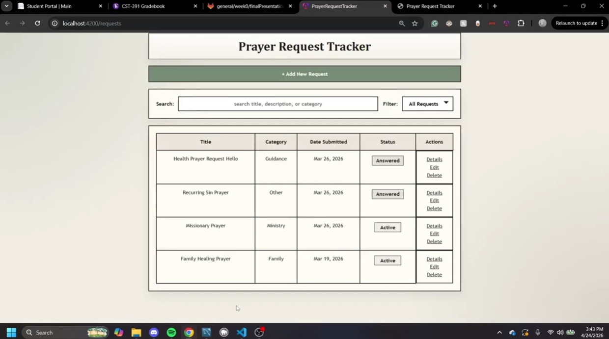

# CST-391: Introduction to JavaScript Web Application Development

## Introduction

CST-391: Introduction to JavaScript Web Application Development at GCU introduced modern approaches to building web applications with JavaScript across both the frontend and backend. Throughout this course, I worked through a progression of assignments that covered Node.js, Express, TypeScript, MySQL, Angular, and React, with an emphasis on how these technologies are used together to create complete web applications.

Over the duration of the course, I progressed from simple setup and introductory framework activities into larger full stack work that required design, implementation, testing, and documentation. The course helped strengthen my understanding of REST APIs, frontend architecture, routing, reusable components, forms, data flow, and the relationship between user interface design and backend services.

## Presentation Artifacts

The primary project artifact for this course is the Prayer Request Tracker, which was an application that I personally designed and chose to develop for the milestone series. I selected this project because it provided an opportunity to build a meaningful full stack application while demonstrating the architectural concepts covered throughout CST-391.

At a high level, the project includes the following artifacts:

- Project proposal and planning documents, including user stories, wireframes, and UML design work.
- A backend REST API built with Node.js, Express, TypeScript, and MySQL.
- An Angular frontend that consumes the backend API.
- A React frontend that also consumes the same backend API.
- Assignment documentation, screenshots, example requests, and screencast recordings that document the development process from proposal to final implementation.

The milestone sequence shows the complete progression of the Prayer Request Tracker from concept to completed full stack application:

- [Milestone 1 - Project Proposal](milestones/milestone1/README.md)
- [Milestone 2 - Refined Project Proposal](milestones/milestone2/README.md)
- [Milestone 3 - Backend API Implementation](milestones/milestone3/README.md)
- [Milestone 4 - Angular Frontend Implementation](milestones/milestone4/README.md)
- [Milestone 5 - React Frontend Implementation](milestones/milestone5/README.md)
- [Milestone 6 - Final Project Demonstration](milestones/milestone6/README.md)

## Screencast Video

The final screencast demonstrates the completed Prayer Request Tracker application in motion. The video includes both the Angular frontend and the React frontend interacting with the same backend API.

Below are two ways to access the video:

- Here is a link to the YouTube screencast video: [Screencast Link](https://www.youtube.com/watch?v=zIpVsk10Spw)

- Below is a screenshot that you can click and it will redirect you to the video on YouTube:

## Christian Worldview

One lesson I have taken from my software development degree at GCU is that technical skill and personal character should not be separated. Writing software is not only about making something work. It is also about building in a way that is honest, responsible, and useful to other people. That includes how we communicate with users, how carefully we test our work, and how much thought we give to the people affected by what we build.

From a Christian worldview, that responsibility is grounded in the way we are called to treat others. Philippians 2:4 says, "Look not every man on his own things, but every man also on the things of others." In software development, I take that to mean I should think beyond my own preferences and build with the user in mind. In the same way, Colossians 3:23 says, "And whatsoever ye do, do it heartily, as to the Lord, and not unto men;" which speaks to the importance of doing careful, high-quality work.

As I move forward in software development, I want that perspective to shape how I design and build applications. I want to create software that is clear, dependable, respectful to the user, and developed with integrity. That is one of the biggest lessons I have taken not only from this class (CST-391), but from my degree as a whole at GCU.

## Activity Assignments

| Activity | Description |
| -- | -- |
| [Activity 0 - NodeJS Installation, Tools, and First Applications](activities/activity0/README.md) | Activity 0 was an introduction to the Node.js development environment, Express basics, and a first TypeScript web server, establishing the technical foundation for later course work. |
| [Activity 1 - Web Application Interfacing with MySQL](activities/activity1/README.md) | Activity 1 was a backend-focused assignment in which a Node.js, Express, and TypeScript application was connected to a MySQL relational database using an MVC-style structure. |
| [Activity 2 - Angular Installation and Starter Application](activities/activity2/README.md) | Activity 2 was an introduction to Angular, including installation, project creation, component updates, and a review of how Angular applications are structured and rendered. |
| [Activity 3 - Angular Components, Routing, and Music Application](activities/activity3/README.md) | Activity 3 was a deeper exploration of Angular through components, routing, forms, data binding, and a multi-component music application frontend. |
| [Activity 4 - Angular HTTP Integration](activities/activity4/README.md) | Activity 4 was an expansion of the Angular music application so that it communicated with a live backend API using HttpClient and asynchronous data handling. |
| [Activity 5 - React Foundations and State](activities/activity5/README.md) | Activity 5 was an introduction to React development through reusable components, props, JSX organization, and early state management concepts. |
| [Activity 6 - React Data Sources and Routing](activities/activity6/README.md) | Activity 6 was a React assignment focused on external data sources, Axios, protected routes, route parameters, and multi-page application structure. |
| [Activity 7 - React Dynamic Components and Forms](activities/activity7/README.md) | Activity 7 was a continuation of React development through dynamic components, controlled forms, and create and edit workflows that made the application behavior more complete and interactive. |

## Milestone Assignments

| Milestone | Description |
| -- | -- |
| [Milestone 1 - Project Proposal](milestones/milestone1/README.md) | Milestone 1 was the initial proposal for the Prayer Request Tracker, including the project concept, user stories, wireframes, UML, and identified development risks. |
| [Milestone 2 - Refined Project Proposal](milestones/milestone2/README.md) | Milestone 2 was a refinement of the original proposal, with clearer technical documentation for the data model, REST endpoints, and application design. |
| [Milestone 3 - Backend REST API](milestones/milestone3/README.md) | Milestone 3 was the implementation of the Prayer Request Tracker backend REST API using Express, TypeScript, MySQL, and Postman-based endpoint testing. |
| [Milestone 4 - Angular Frontend](milestones/milestone4/README.md) | Milestone 4 was the Angular frontend implementation, where the previously completed backend API was extended with a browser-based user interface. |
| [Milestone 5 - React Frontend](milestones/milestone5/README.md) | Milestone 5 was the React frontend implementation, demonstrating that the same backend API could support a second frontend framework with equivalent core functionality. |
| [Milestone 6 - Final Project Demonstration](milestones/milestone6/README.md) | Milestone 6 was the final demonstration of the Prayer Request Tracker as a completed full stack application featuring both Angular and React frontends on top of the same backend. |

## Conclusion

CST-391 combined frameworks, backend services, and database integration all into one course. The way it was structured was first an activity would establish the technical building blocks, and then the corresponding milestone assignment would provide a place to apply those ideas into a more complete and sustained project.

The Prayer Request Tracker is the strongest representation of what I learned in this course because it shows the full development process from planning and design through implementation, testing, and presentation. Since it was a project that I personally designed and chose to pursue, it also reflects my ability to define a practical application idea and carry it through multiple stages of technical development. As a complete course summary, this repository demonstrates both my academic work in CST-391 and my growth in full stack JavaScript web application development.
