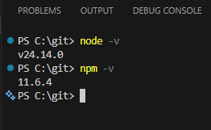
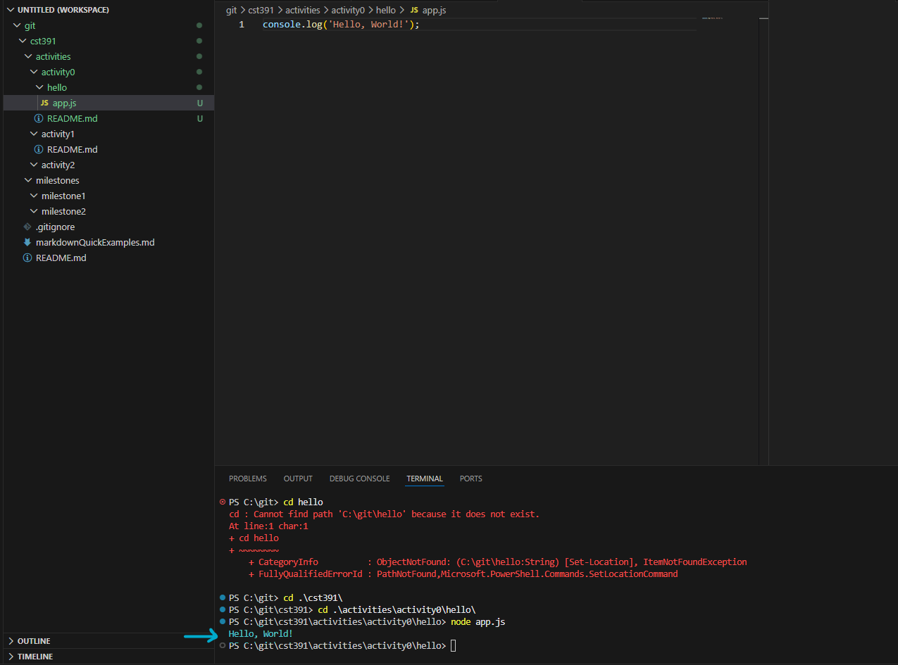
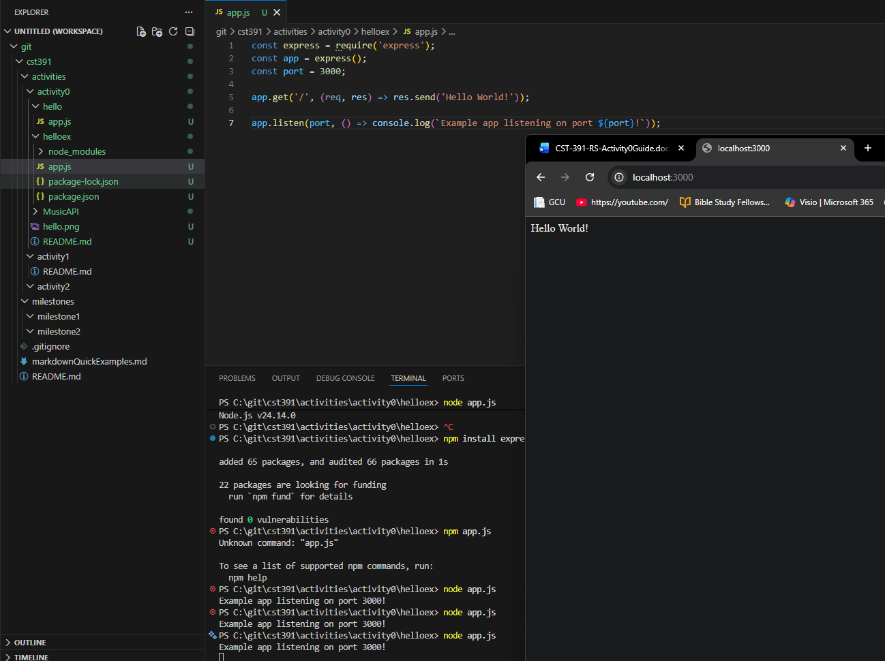
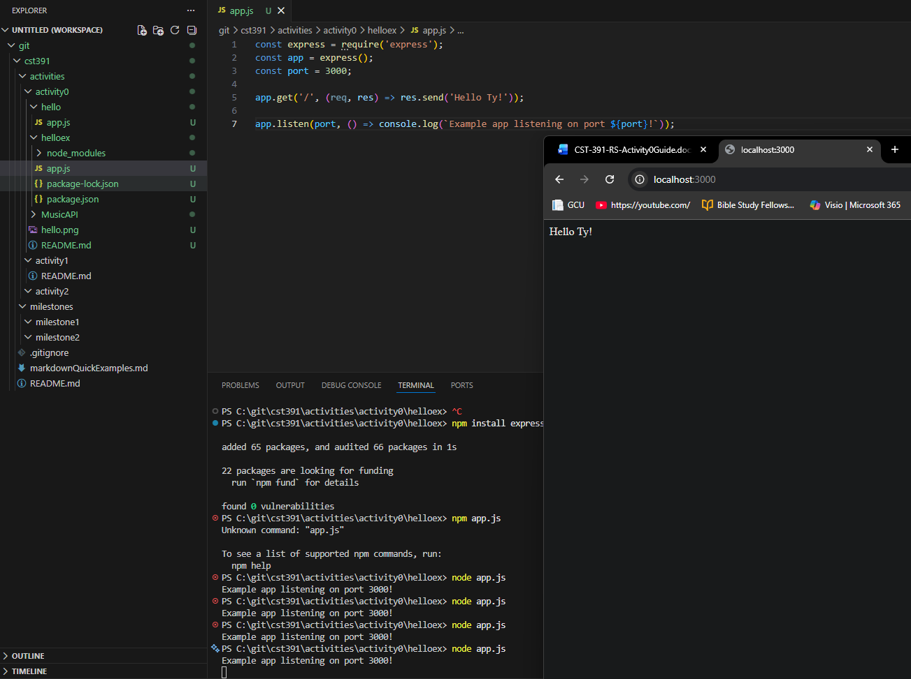
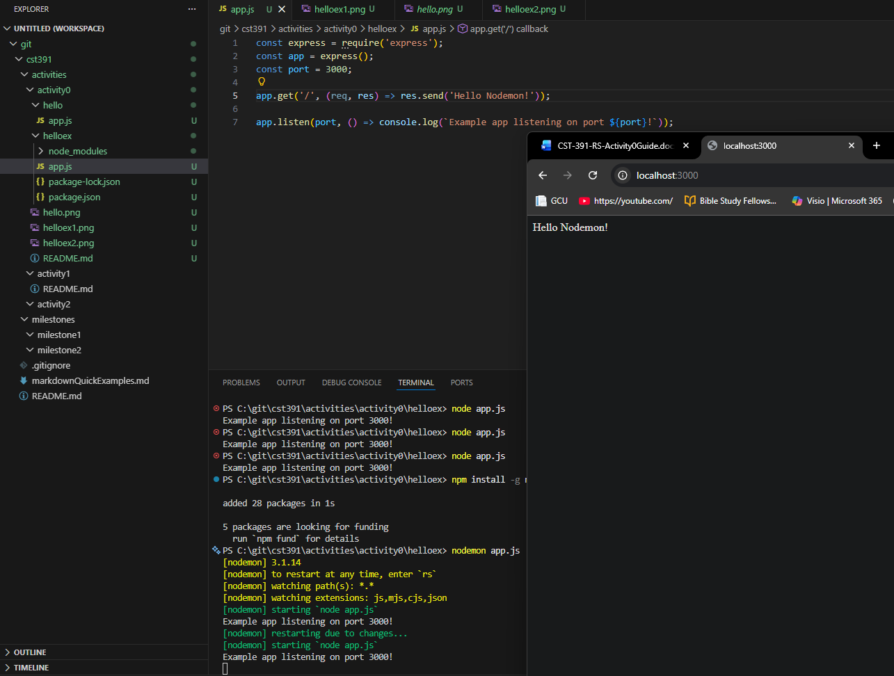
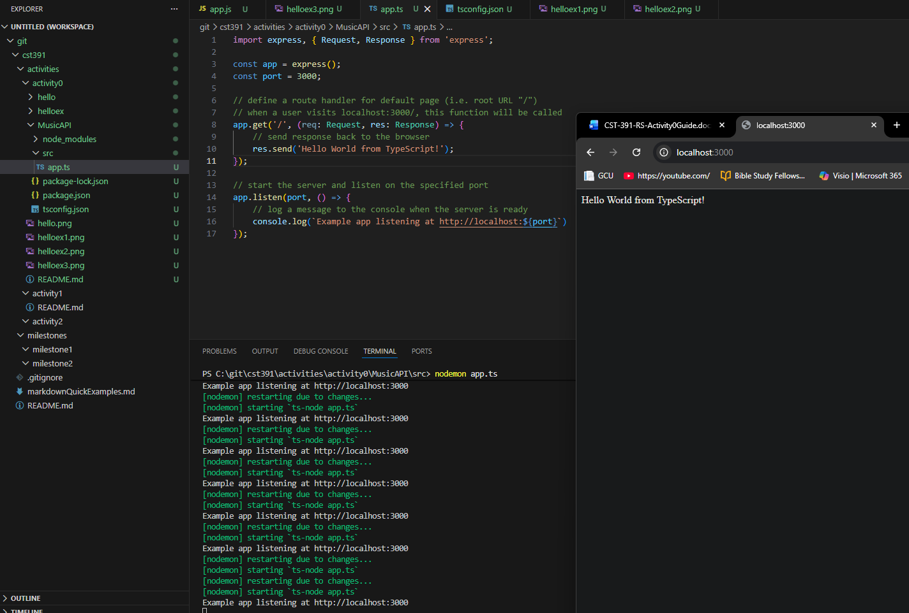

# Activity 0

This is activity covers NodeJS Installation, Tools, and First Applications. It can be divided into two parts:

- Part 1: Tools Installation and Hello World
- Part 2: Node.js with TypeScript

---

## Part 1: Tools Installation and Hello World

The first part of this activity focuses on installing and verifying the Node.js development environment and creating two simple applications using Node.js and Express.

### Node Version

The NodeJS installation was verified by running the following command in the terminal.

- node -v

This command prints the installed version of NodeJS and confirms that Node is correctly installed on the system.



### NPM Version

The NPM version was verified using the following command in the terminal.

- npm -v

These commands display the installed versions of Node.js and NPM. Confirming these installations ensures the system is correctly configured to run JavaScript applications and install dependencies.

### Hello World Console App

A simple NodeJS console application was created in the **hello** directory. The file `app.js` contains the following code:

```javascript
console.log('Hello, World!');
```

It was then executed using 

- node app.js

The terminal output confirms that the JS file executed successfully:



### Hello World in the Browser

An Express web server was created in the helloex project. Express allows developers to build simple web applications and APIs using NodeJS.

The server listens on port 3000 and responds to requests at the root URL.

The application was initially started using 'node app.js', the same as before.

The browser was the opened to 'http://localhost:3000' and you can see that the message was displayed in the browser:



We can easily change the message. Here I changed it from 'Hello World!' to 'Hello Ty', and manually restarted the app. You can see that the message updated accordingly:



### Hello World in the Browser using Nodemon

Nodemon was then installed to automatically restart the NodeJS server whenever code changes are detected.

After installation, the server was restarted using 

- nodemon app.js

You can see that every time a change is made to app.js it sends a message in the terminal and restarts the connection:



Below is the code for the helloex application in its final state:

```js
const express = require('express');
const app = express();
const port = 3000;

app.get('/', (req, res) => res.send('Hello Nodemon!'));

app.listen(port, () => console.log(`Example app listening on port ${port}!`));
```

## Part 2: Node.js with TypeScript

This section demonstrates creating a NodeJS Express server using TypeScript.

### Hello World TypeScript in the Browser

A new project named MusicAPI was created using Express and TypeScript. The main application file 'app.ts' is located in the 'src' directory.

The server was started using 

- nodemon app.ts

After starting the server, the application was opened in the browser at 'http://localhost:3000'

You can see that the Browser correctly displays 'Hello World from TypeScript!' into the Browser:



Below is the commented TypeScript implementation that is used inside the MusicAPI project:

```Typescript
import express, { Request, Response } from 'express';

const app = express();
const port = 3000;

// define a route handler for default page (i.e. root URL "/")
// when a user visits localhost:3000/, this function will be called
app.get('/', (req: Request, res: Response) => {
    // send response back to the browser
    res.send('Hello World from TypeScript!');
});

// start the server and listen on the specified port
app.listen(port, () => {
    // log a message to the console when the server is ready
    console.log(`Example app listening at http://localhost:${port}`)
});
```

This implementation demonstrates how Express can be used with TypeScript to build a simple web server while benefiting from static typing and improved code clarity.

Very interesting introduction to Angular, though I do have a bit of experience already. Looking forward to the next activity.