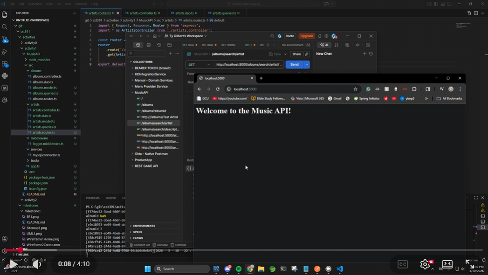
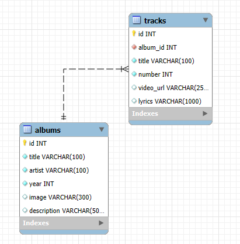
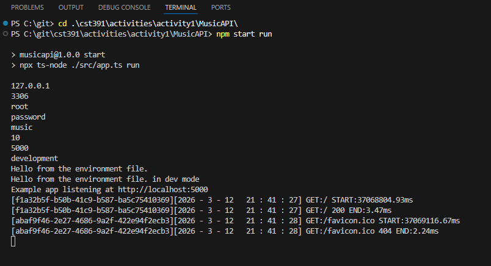

# Activity 1

- Author: Ty Gilbert
- 08 March 2026

## Summary

- Activity 1 is an example of a Web Application interfacing to a MySQL Relational Database
     - The Architecture follows a Model View Controller (MVC) strucutre, which I learned in a previous class (CST-215).
          - Model - the maintainer of the data, i.e. Database
          - View - the User Interface, which at the current state of the application, is the Web Browser
          - Controller - Middleware and the Management / Coordinator of the Application
     - The products utilized in the activity are the following:
          - [Node JS](https://nodejs.org/en)
          - [Node Package Manager](https://www.npmjs.com/)
          - [Express API](https://expressjs.com/en/api.html)
          - [TypeScript](https://www.typescriptlang.org/)
          - [MySQL](https://www.mysql.com/)

## Recording

Below are two ways to access the recording:

- Here is a link to the YouTube screencast video: [Screencast Link](https://youtu.be/_43N_BU-WW4)

- Below is a screenshot that you can click and it will redirect you to the video on YouTube:


[](https://youtu.be/_43N_BU-WW4)

## Environmental Variables 

- [.env File](MusicAPI/.env)

- The following are the variables defined for the MySQL Database, this can be found within the .env file, which is linked above.

```
#MySQL Settings
MY_SQL_DB_HOST=127.0.0.1
MY_SQL_DB_USER=root
MY_SQL_DB_PASSWORD=password
MY_SQL_DB_PORT=3306
MY_SQL_DB_DATABASE=music
MY_SQL_DB_CONNECTION_LIMIT=10

#Server Settings
PORT=5000
NODE_ENV=development
GREETING=Hello from the environment file. Be kind to the environment!
```

## Database Initialization

- Start MySQL Workbench
- Copy [Initialization File](./CST-391MusicDBCurrentVersion.sql) into SQL Query
     - Icon SQL + under File in the application
- Execute Query



## Activity 1 Commands

- The following commands are installation instructions for the various products required for this assignment

```
cd ~/git/cst391/activities/activity1/MusicAPI

npm install -g nodemon
npm install dotenv
npm install cors
npm install helmet
npm install mysql
npm install uuid
npm install @types/cors --save-dev
npm install @types/dotenv --save-dev
npm install @types/mysql --save-dev
npm install @types/uuid --save-dev
npm install nodemon --save-dev
npm install ts-node --save-dev

npm start
```

## Test Links

- The following are test links that are used to validate the application is executing and communicating with the MySQL Database as intended.
- The images illustrate the results being displayed in Postman.

|Method|Link|Postman Image|Path Variable / Body|
|--|--|--|--|
|GET|http://localhost:5000/|[Postman](base1.png)||
|GET|http://localhost:5000/albums/|[Postman](albums2.png)|
|GET|http://localhost:5000/albums?albumId=7|[Postman](albumsalbumid3.png)||
|GET|http://localhost:5000/albums/:search|[Postman](albumssearch4.png)|search="Test Artist"|
|GET|http://localhost:5000/albums/search/artist/:search|[Postman](albumssearchartist5.png)|searh="Test"|
|GET|http://localhost:5000/albums/search/description/:search|[Postman](albumssearchdesc6.png)|search="sgt"|
|POST|http://localhost:5000/albums|[Postman](postalbums7.png)|[POST JSON](post.png)|
|PUT|http://localhost:5000/artists/?artistId=3|[Postman](putartists8.png)|[PUT JSON](put.png)|
|DELETE|http://localhost:5000/albums/?albumId=12|[Postman](deleteartists9.png)||

Below is the System Output displaying the SQL variables and database connection:



## Conclusion

In this activity, I learned how to build and test a basic backend web API that communicates with a MySQL database using Node.js and Express. This project was built using Model–View–Controller (MVC) architecture, which organizes an application by separating responsibilities between the database (model), the API logic (controller), and the user interface or client (view). Using Express and TypeScript, I implemented API endpoints that perform CRUD operations on album data stored in the MySQL database. I also learned how environmental variables can be used to securely store configuration values such as database credentials and server settings through the .env file.

Another important concept demonstrated by the completion of this activity per the requirements was testing API endpoints using Postman. By sending GET, POST, PUT, and DELETE requests, I was able to verify that the API successfully communicates with the database and returns the correct results. Additionally, I gained experience installing and configuring development dependencies using npm and setting up the project environment to run the application locally.

Overall, very interesting activity. It reinforces lots of the processes that I already understood about relational databases and writing in strctured codebases.