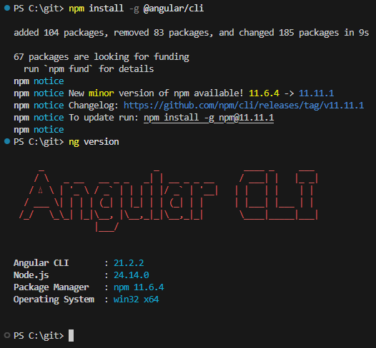
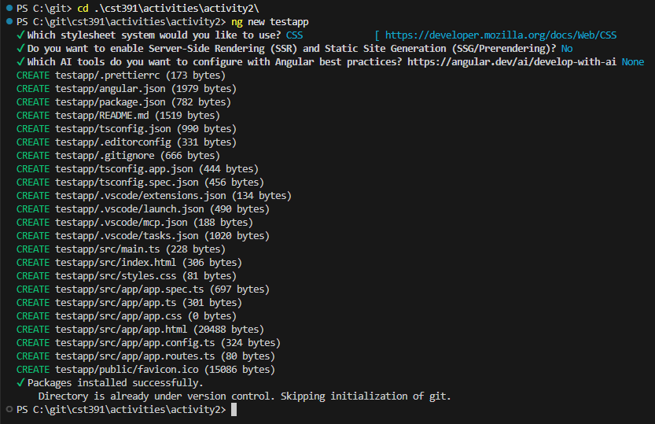
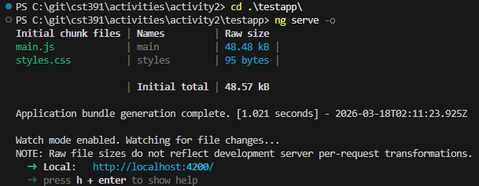
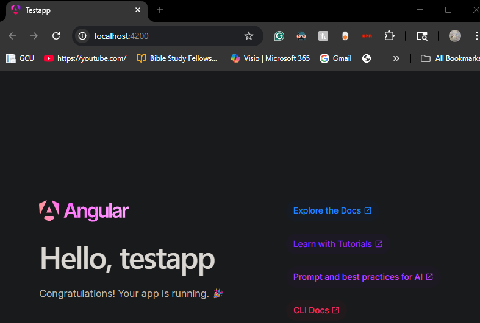
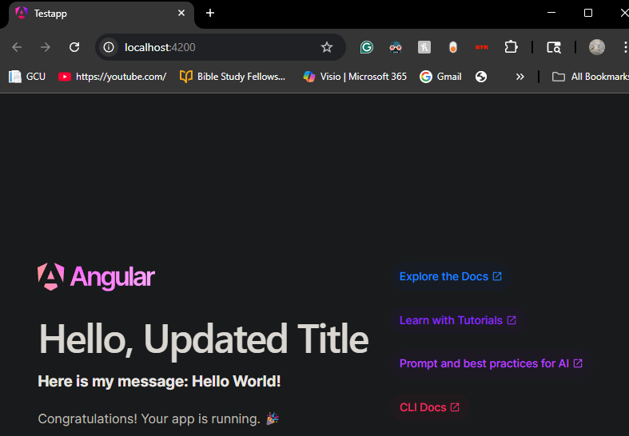

# Activity 2

- Author: Ty Gilbert
- 17 March 2026

## Summary

This activity focused on installing Angular, creating a new Angular application titled "testapp", runnning it locally, and making simple modifications to the generated app to better understand how Angular components work.

## Commands

- Install the latest version of Angular

```
npm install -g @angular/cli
```

- Display the Angular Version

```
ng version
```

Screenshot:



- Create a new Angular project, this case we will call testapp

```
ng new testapp
```

Screenshot:



- Change directory to the new project and start the server

```
cd .\testapp\
ng serve -o
```

Screenshots:



- Visit the localhost webpage at the provided port (in this case, 4200)
     - Local: http://localhost:4200



## Modifying Testapp

### app.ts

```typescript
import { Component, signal } from '@angular/core';
import { RouterOutlet } from '@angular/router';

@Component({
  selector: 'app-root',
  imports: [RouterOutlet],
  templateUrl: './app.html',
  styleUrl: './app.css'
})
export class App {
  protected readonly title = signal('Updated Title');
  protected readonly message = signal('Hello World!');
}
```

### app.html (segment)

```html
      <h1>Hello, {{ title() }}</h1>
      <h3>Here is my message: {{ message() }}</h3>
      <p>Congratulations! Your app is running. 🎉</p>
```

After making these changes, the updated title and added message are displayed on the webpage:



## Research

a. Angular Project Structure

Folders:
- node_modules
     - Contains all the install dependencies for the Angular project.
     - This folder is automatically generated.
- src
     - The main source folder for the application.
     - Contains all the application code, assets, and configurations used during development.
- src/app
     - Contains the core application logic.
     - Includes components, services, and modules that define how the app behaves.
- src/assets
     - Stores static files like images, icons, and fonts.
- src/environments
     - Contains enviornment-specific configuration files.
     - Typically includes:
          - enviornment.ts (development)
          - enviornment.prod.ts (production)

Files:
- angular.json
     - Configuration file for Angular CLI.
     - Defines project settings such as build options, file paths, assets, and styles.
     - Controls how the app is built and served.
- package.json
     - Defines project dependencies and scripts.
     - Includes:
          - Installed packages
          - Project metadata
          - Scripts like ng serve, ng build
     - Used by npm to manage dependencies.
- tsconfig.json
     - TypeScript configuration file.

b. How Angular Generates the Page

When the Angular app runs, it does not serve a static HTML page. Instead, it dynamically builds the page using components and bootstrapping.

Key Files:
- main.ts
     - Entry point of the Angular application.
     - Starts the application and loads it into the browser.
- app.component.ts
     - Defines the root component logic.
     - Contains:
          - Component metadata (selector, template, styles)
          - Variables and functions (e.g. title, message)
     - Acts as the controller for the UI.
- app.component.html
     - Defines the structure of the component.
     - Uses Angular template syntax like:
          - {{ }} for data binding, like we did in this activity.
     - Displays dynamic data from the component.
- app.component.css
     - Contains styles specific to the component.
     - Controls layout, colors, fonts, and visual appearance.
- app.module.ts
     - Defines the root module of the application.
     - Registers component, imports dependencies, and configures the app.

The whole process works like this:

1. main.ts starts the application
2. Angular loads the root module/component
3. The root component (app.component.ts) provides data
4. The template (app.component.html) renders the UI
5. Styles (app.component.css) are then applied
6. Angular updates the DOM dynamically when data changes.

The above documented process is what allows Angular to create dynamic and interactive web applications instead of static pages.

## Conclusion

In this activity, I learned how to set up and run an Angular application using the Angular CLI. After generating the default testapp, I edited the default project and learned how Angular components control both the logic and presentation of a webpage in Angular through data binding.

Overall, I already have a decent bit of knowledge when it comes to Angular so I didn't learn a whole ton. But this was a great refresher and I am excited to see what is left in store for me in this class!