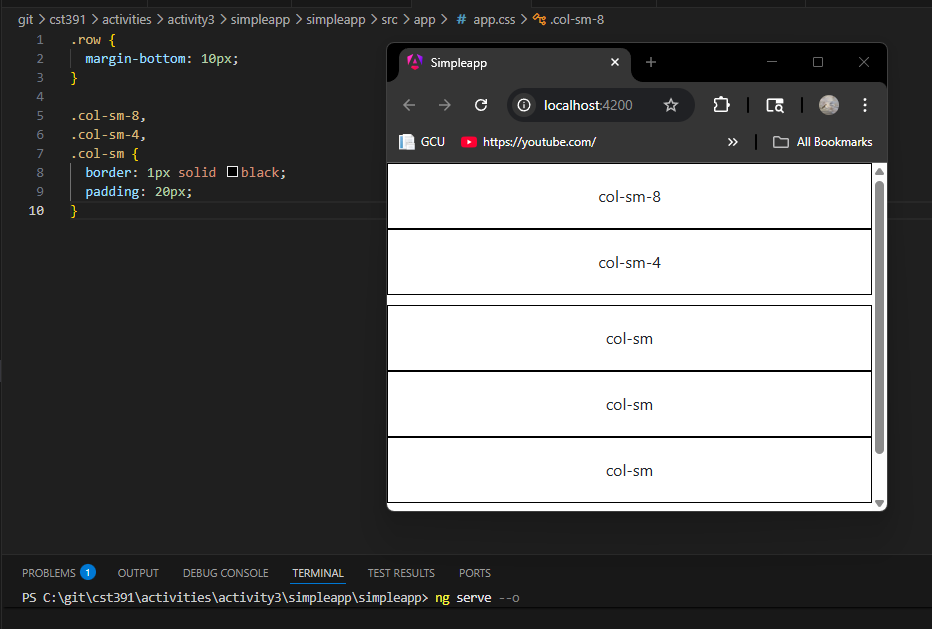
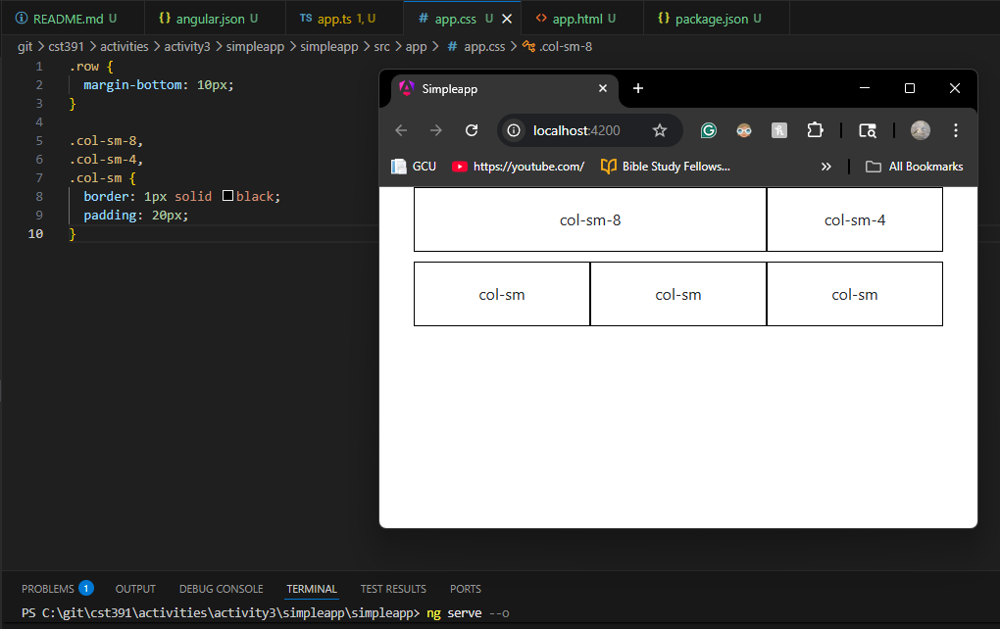
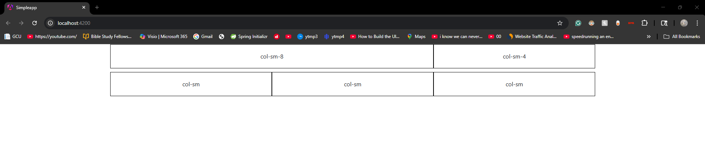
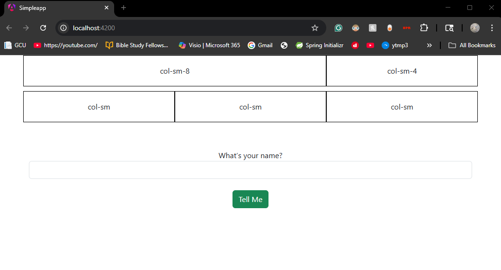
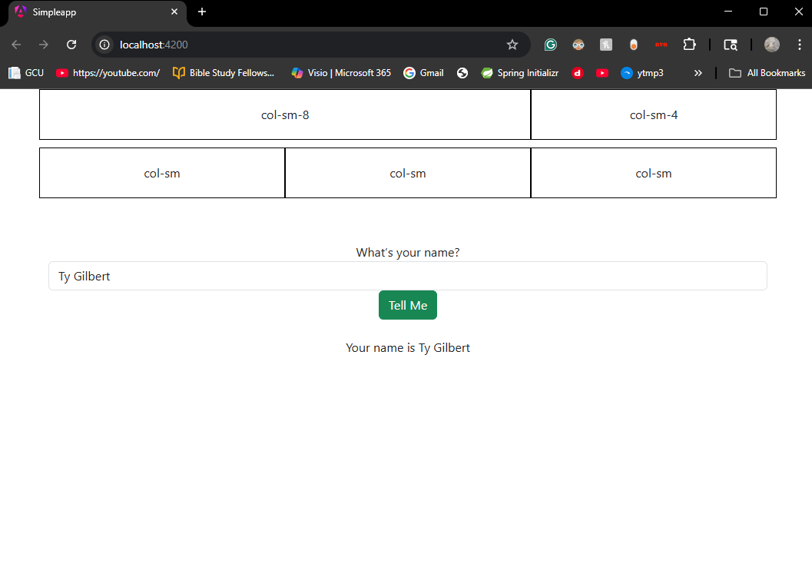
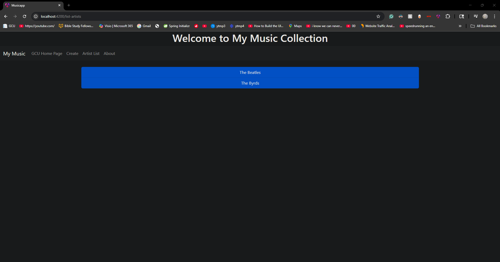
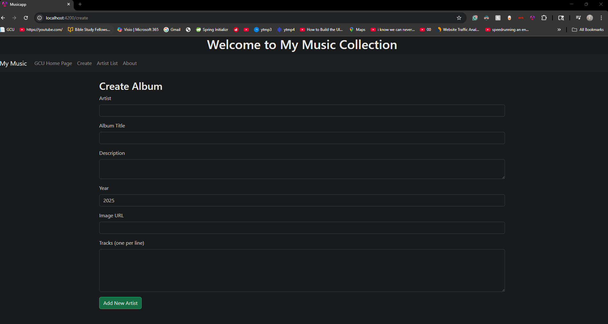
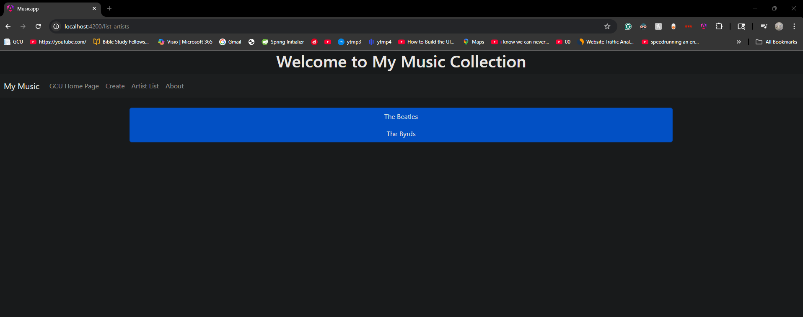
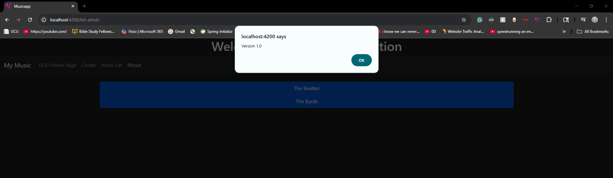

# Activity 3

- Author: Ty Gilbert
- 20 March 2026

## Summary

Activity 3 continues our work with Angular and is divided into two main parts. The first part focused on simple Angular concepts such as components, routing, event handling, and data binding using a simple application. The second part then expanded on these concepts by building a more complex music application that utilizes multiple components, services, and dynamic data interaction.

The primary goal of this activity was to work with/ gain a better understanding of Angular’s structure and how frontend applications are built using modular components, routing systems, and shared services for data management.

## Part 1: Basic Angular Components, Events, Routes, and Data Binding

In Part 1, I created a basic Angular application called *simpleapp* to explore core Angular concepts. This included creating components, handling user input, implementing routing, and binding data between the component and the view.

Key concepts practiced:

- Creating Angular components
- Using interpolation for data binding
- Handling form input and events
- Implementing routing between components
- Using reactive forms

### Bootstrap Grid Layout: Responsive Webpage

In order to demonstrate the responsiveness of this page to changes in dimension, I collected a few screenshots of the webpage application at various sizes:

*Please note: I introduced CSS styling adding borders and padding to each column, making it easier to visualize how the provided grid is divided*

- Extra Small



- Small



- Large



### User Input: Data Binding

This screenshot shows the application before the user interacts with the form. The input field for “What’s your name?” is empty, and no output is displayed below the button. At this point, the UI has been rendered but no dynamic updates have been made.



This screenshot shows the result after entering a name and clicking the “Tell Me” button. The application displays the message “Your name is Ty Gilbert,” confirming that the input value was successfully captured and bound to the component. This is a demonstration of a dynamic UI update as a result of Angular interpolation ```{{ }}``` . Two-way data binding between the input field and the component is at play.



## Creating a Music Application - The Front End

In Part 2, I developed a frontend music application using Angular. This application demonstrates how multiple components interact with each other and how a shared service can manage application data.

At this point, this application allows users to:

- View a list of artists
- Select an artist to view their albums
- View album details
- Create a new album using a form
- Navigate between pages using Angular routing

### Application Features: Setup

- Navigation Bar
     - My Music (Home Page)
     - GCU Home Page (External Link)
     - Create Album Page
     - Artist List Page
     - About (Version Display)
- Create Album
     - Form to add a new album
     - Supports artist, title, description, year, image, and tracks
     - Submitting updates the in-memory data
- Artist List
     - Displays all artists
     - Dynamically updates when a new album is added
- Album Display
     - Shows album image, title, year, and description
- Service Layer
     - Handles all data operations (CRUD)
     - Uses the provided JSON file as the intial datasource

### Application Features: Screenshots

- My Music (Home Page)



- GCU Home Page (External Link)


- Create Album Page



- Artist List Page



- About (Version Display)



### Research Segment: Music Service (Fully Commented)

Below is the fully commented version of the *music-service.service.ts* file. This service acts as the data layer for the application.

```typescript
// this service manages all music data for the application
// it loads initial data from a json file and provides methods
// to retrieve, add, update, and delete albums

import { Injectable } from '@angular/core';
import * as exampledata from '../../data/sample-music-data.json';
import { Artist } from '../models/artist';
import { Album } from '../models/album';

@Injectable({
  providedIn: 'root'
})
export class MusicService {

  // this holds all album data loaded from the json file
  albums: Album[] = (exampledata as any).default ?? (exampledata as any);

  constructor() {}

  // returns a unique list of artists based on the albums array
  getArtists(): Artist[] {
    const artists: Artist[] = [];

    for (const album of this.albums) {
      const exists = artists.find(a => a.artist === album.artist);
      if (!exists) {
        artists.push({
          artist_id: album.artist_id,
          artist: album.artist
        });
      }
    }

    return artists;
  }

  // returns all albums that belong to a specific artist
  getAlbumsOfArtist(artist: string): Album[] {
    return this.albums.filter(album => album.artist === artist);
  }

  // returns a single album based on artist and album id
  // returns null if no matching album is found
  getAlbum(artist: string, id: number): Album | null {
    const foundAlbum = this.albums.find(
      album => album.artist === artist && album.album_id === id
    );

    return foundAlbum ?? null;
  }

  // creates a new album and adds it to the albums array
  // generates a new album_id automatically
  // returns the new album id if successful, or -1 if an error occurs
  createAlbum(album: Album): number {
    try {
      const maxId = this.albums.length > 0
        ? Math.max(...this.albums.map(a => a.album_id))
        : 0;

      album.album_id = maxId + 1;
      this.albums.push(album);

      return album.album_id;
    } catch {
      return -1;
    }
  }

  // updates an existing album based on album_id
  // replaces the old album with the updated one
  // returns 0 if successful, -1 if the album is not found
  updateAlbum(album: Album): number {
    const index = this.albums.findIndex(a => a.album_id === album.album_id);

    if (index !== -1) {
      this.albums.splice(index, 1, album);
      return 0;
    }

    return -1;
  }

  // deletes an album using both id and artist
  // returns 0 if successful, -1 if the album is not found
  deleteAlbum(id: number, artist: string): number {
    const index = this.albums.findIndex(
      album => album.album_id === id && album.artist === artist
    );

    if (index !== -1) {
      this.albums.splice(index, 1);
      return 0;
    }

    return -1;
  }
}
```

## Conclusion

In this activity, I learned how Angular applications are structured and how different components interact within a frontend system. Part 1 helped me understand the basics of Angular, including components, routing, and data binding. Part 2 then expanded on these concepts by introducing a more complex application with multiple components and a shared service.

The primary issues I faced in this activity ultimately come down to a version mismatch between the version of Angular that I chose to use (version 21) and the one that the activity was wriitten in (version 17). There are many structural differences between the two, but I figured I would challenge myself and stay in the newer version.

Overall, this is the first activity thus far that I felt strengthened my overall understanding of Angular and I believe this will provide a solid foundation for building more advanced frontend applications in the future. 

Thank you.
