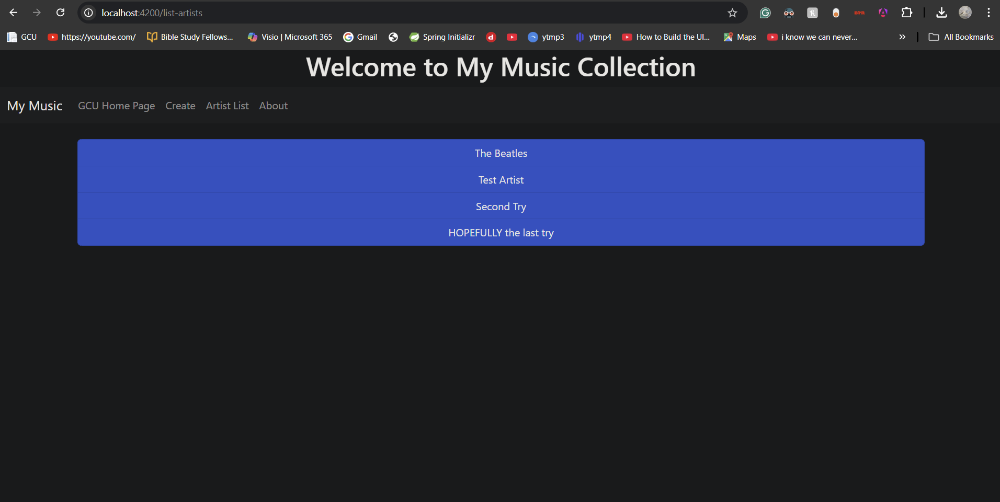
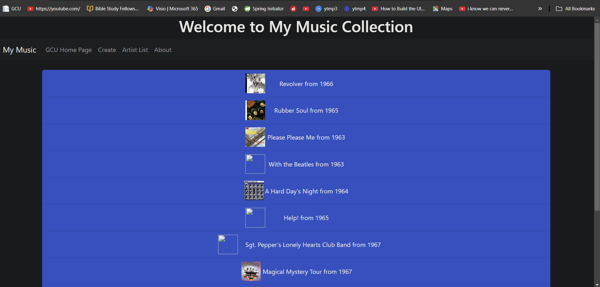
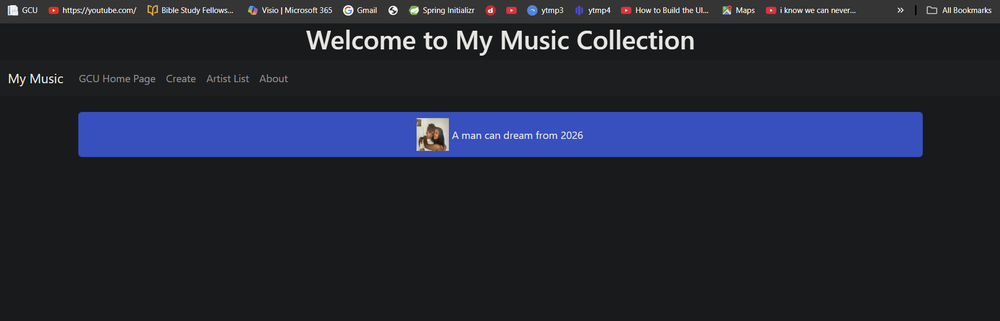
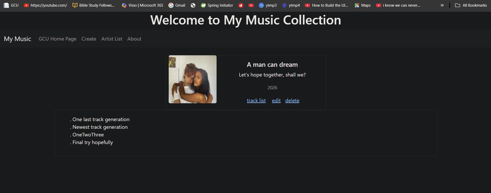
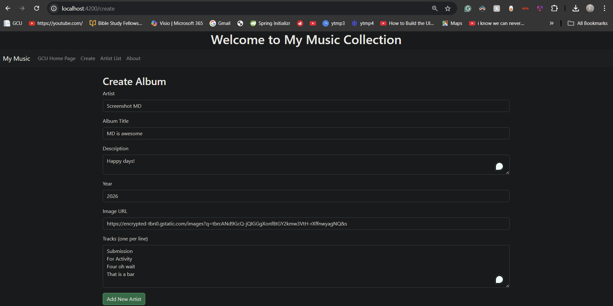
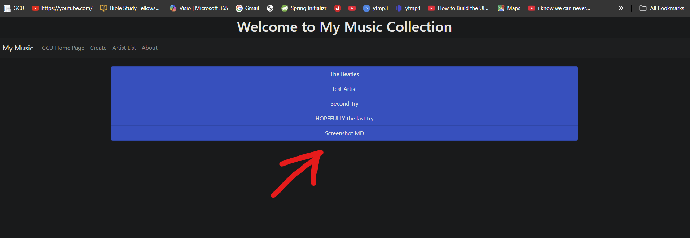
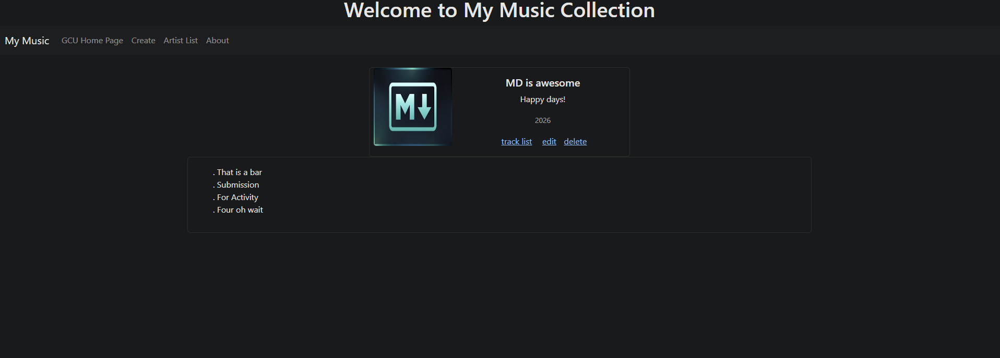
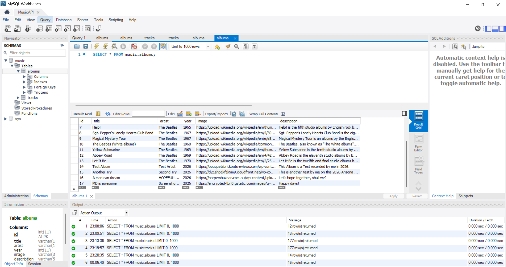
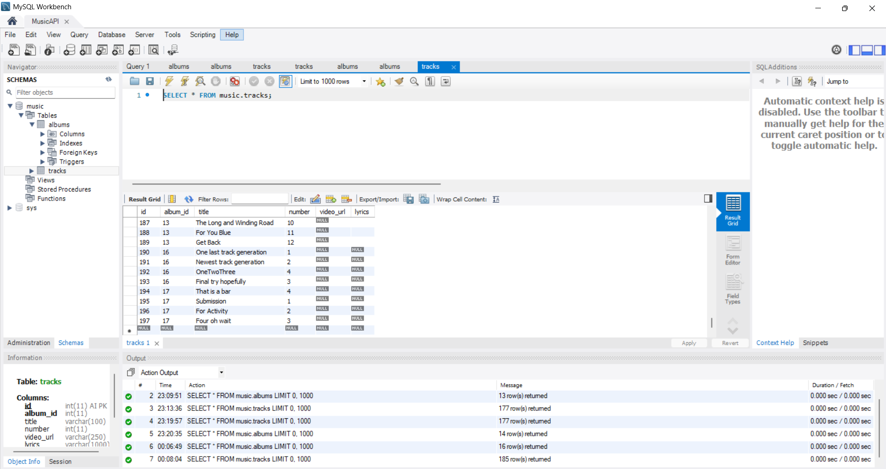

# Activity 4

- Author: Ty Gilbert
- 24 March 2026

## Summary

Activity 4 builds on the previous music application by integrating the Angular frontend with a backend API. Instead of using hard-coded JSON data, the application now retrieves and modifies data through HTTP requests to a live server.

The primary goal of this activity was to understand how frontend applications communicate with backend services, how asynchronous data is handled in Angular, and how a full stack application operates using a client-server model.

## Part 1: Angular Integration with HTTP Client

In this part of the activity, I updated the Angular application to use the built in HttpClient module to communicate with the backend API. This required modifying the application configuration and refactoring the service layer to replace hard-coded data with live API calls.

### Refactoring the Music Service

The MusicService was updated to remove the use of static JSON data and instead call backend endpoints. Each method now sends HTTP requests and uses callbacks to handle asynchronous responses.

Updated functionality includes:
- Retrieving artists from /artists
- Retrieving albums from /albums and /albums/:artist
- Creating new albums using POST /albums
- Updating albums using PUT /albums
- Deleting albums using DELETE /albums/:id

This change required updating all components that depended on the service to handle asynchronous data instead of immediate return values.

### Application Features: Backend Integration

The application now supports full interaction with a backend database. Please read through the notable backend integration application features implemented as a part of the changes made for this activity:

**Artist List**

- Dynamically loaded from the backend API
- Updates automatically after creating new albums

**Album List**

- Retrieved per artist using API calls
- Displays real database data

**Album Display**

- Shows album details and associated tracks from database

**Create Album**

- Sends new album data to backend
- Inserts both album and tracks into database

**Service Layer**

- Handles all the HTTP communication
- Uses callbacks for asynchronous data flow

### Application Features: Screenshots

#### Main Application Screen / Artist List Screen -

This screenshot shows the main application screen. This is the first page that the user sees upon visiting the application. This is synonymous with the artist list screen, since by visiting the base url you will automatically be forwarded to the `/list-artists` endpoint.

#### Album List Screen - 

Upon clicking on an artist on the main application / artist list screen, you will be directed to thge album list page where the albums for that artist is listed. You can see these are the albums listed under the artist "*The Beatles*".

This second screenshot shows the albums listed for a newly created artist "*HOPEFULLY the last try*".

#### Album Display (With Tracks) Screen - 

After clicking on the album "*A man can dream*" by HOPFULLY the last try, we reach the album display screen. I then selected track list and it displayed the tracks that are present in this album.

#### Create Album Screen - 

If you click "Create" on the Navbar, this will direct you to the create album screen, where you can create an album or a subsequent artist (if it does not yet exist). Here you can see that I am filling out the form with example information.

After creating the album/artist, you can see that the new artist is now displayed on the main application screen.

I am then able to interact with this new album/artist in any way that I please.

#### MySQL Database Proof -

You can see that these changes are persisted in the database for both tracks and albums tables.

### Research Segment: Angular Logged-in State

Angular applications maintain a logged-in state by storing authentication data such as a token (for example, JWT) or a session cookie after a successful login. This data is typically stored in browser storage.

To communicate this state to the server, Angular includes the token in HTTP requests, usually in the Authorization header. This is often handled automatically using an HTTP interceptor. The backend then validates the token to determine whether the user is authenticated.

## Conclusion

In this activity, I learned how to connect a frontend Angular application to a backend API and handle real data instead of relying on static JSON. This introduced important concepts such as asynchronous programming, HTTP communication, and full-stack integration.

I also encountered and resolved several issues related to data mismatches, backend errors, and Angular configuration, which, by working through those issues, I was able to deepen my understanding as to how frontend and backend systems must/do align.

Apart from that, the primary issues I faced in this activity ultimately come down to a version mismatch between the version of Angular that I chose to use (version 21) and the one that the activity was wriitten in (version 17). There are many structural differences between the two, but I figured I would challenge myself and stay in the newer version.

In this activity, I learned how to connect a frontend Angular application to a backend API and handle real data instead of relying on static JSON. This introduced important concepts such as asynchronous programming, HTTP communication, and full-stack integration.

I also encountered and resolved several issues related to data mismatches, backend errors, and Angular configuration, which helped deepen my understanding of how frontend and backend systems must align.

Overall, this activity definitely improved my understanding of how real world web applications function and how data flows between the client and server.

Thank you.
