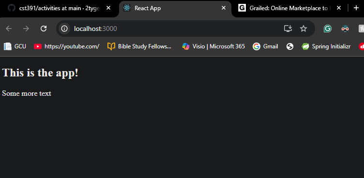
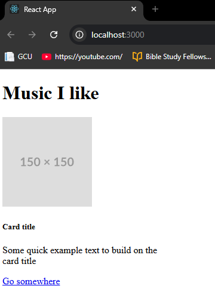
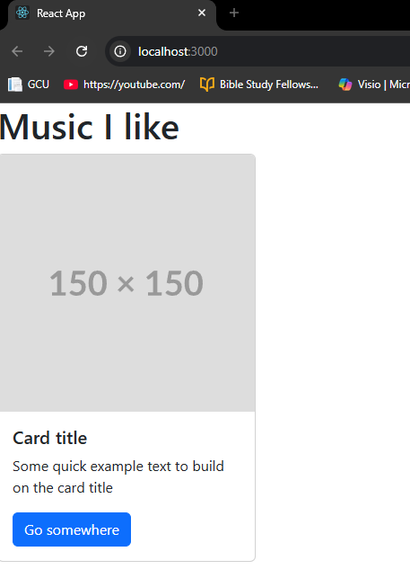
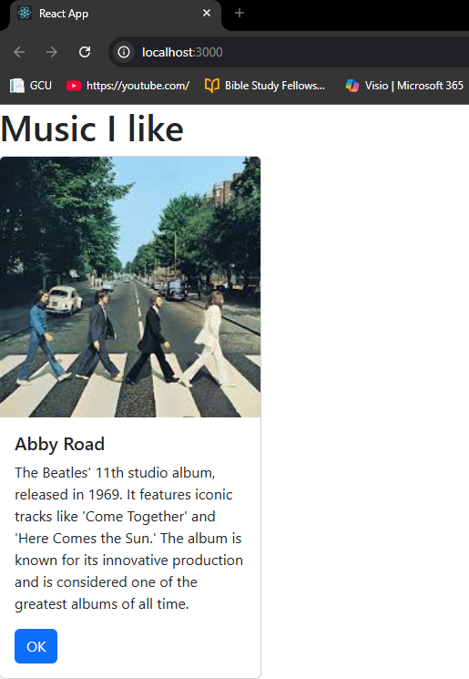
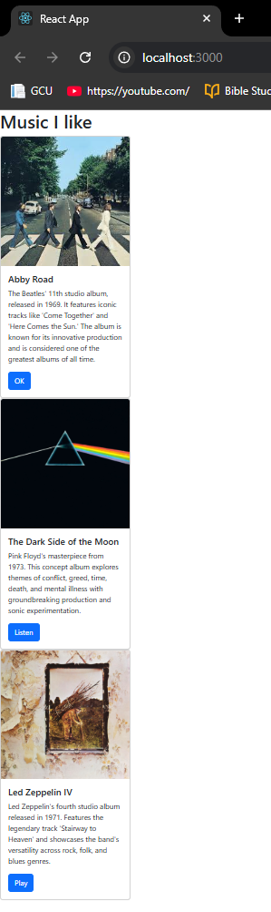
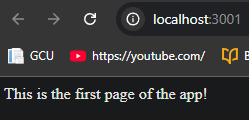
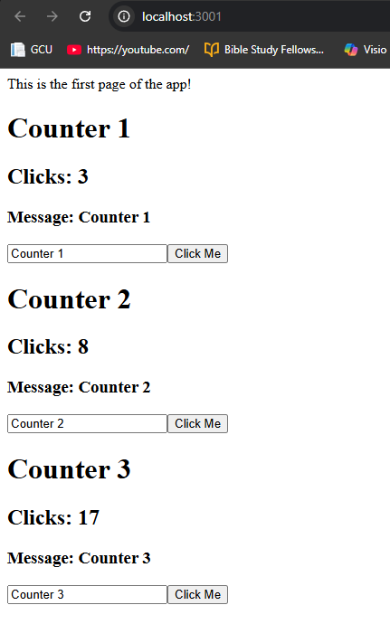
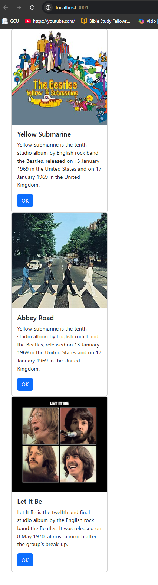
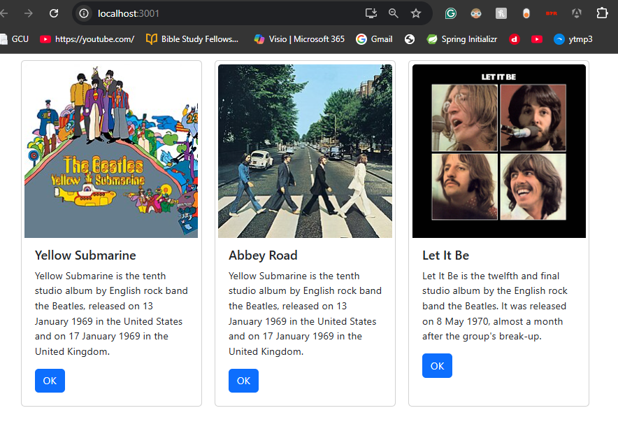

# Activity 5

- Author: Ty Gilbert
- 5 April 2026

## Part 1: React Music App Introduction

### Create the React 'music' app

- Create the application by typing `npx create-react-app music` in the terminal
- Navigate into the project folder and start the development server with `npm start`
- Remove the src files and recreate the application from scratch starting with `index.js` (please continue to the next section to see this)

### Build the first component

- Add a new `index.js` file in `src`
- Import React and ReactDOM from `react-dom/client`
- Create a simple `App` component that returns placeholder information
- Render the `App component to the page using `ReactDOM.createRoot(...).render(<App />)`

Below I have provided the `index.js` file at this current stage, reflecting the above mentioned steps:

```javascript
import React from 'react';
import ReactDOM from 'react-dom/client';

const App = () => {
    return <div>
                <h2>This is the app!</h2>
                <p>Some more text</p>
            </div>
}

const root = ReactDOM.createRoot(document.getElementById('root'));
root.render(<App />);
```



### Create an Unformatted Card

- Update the `App` component to feature card information such as: title, image, description, button
- This will act as a method for displaying album information in the future.

Below I have provided the `index.js` file at this current stage, reflecting the above mentioned steps:

```javascript
import React from 'react';
import ReactDOM from 'react-dom/client';
import './Card.css';

const App = () => {
    return <div>
                <h1>Music I like</h1>

                <div className="card" style={{ width: '18rem' }}>
                
                <div className="card-body">
                    <h5 className="card-title">Card title</h5>
                    <p className="card-text">Some quick example text to build on the card title</p>
                    <a href="#" className="btn btn-primary">Go somewhere</a>
                </div>
                </div>
            </div>
}

const root = ReactDOM.createRoot(document.getElementById('root'));
root.render(<App />);
```



### Add Bootstrap Styling (Update to Formatted Card)

- Include the Bootstrap stylesheet in `public/index.html`:

```html
<link rel="stylesheet" href="https://cdn.jsdelivr.net/npm/bootstrap@5.3.0/dist/css/bootstrap.min.css">
```




### Create a Reusable Card Component

- Create a new `Card.js` in `src`.
- Move the card markup into its own component so the UI could be reused
- The `Card` component returns a Bootstrap card structure, including image, title, description, and button (as before mentioned)
- Exported the component with `export default Card;`

Below I have provided the `Card.js` file at this current stage, reflecting the above mentioned steps:

```javascript
import React from 'react';

const Card = () => {
    return (
        <div className="card" style={{ width: '18rem' }}>
            
            <div className="card-body">
                <h5 className="card-title">Card title</h5>
                <p className="card-text">Some quick example text to build on the card title</p>
                <a href="#" className="btn btn-primary">Go somewhere</a>
            </div>
        </div>
    );
};

export default Card;
```

Since the `Card` component has been relocated, `index.js` can be replaced with the below segment:

```javascript
const App = () => {
    return (
        <div>
            <h1>Music I like</h1>

            <Card />
            <Card />
            <Card />
        </div>
    );
}
```

You may notice that there are now 3 blank card codes. These card codes are rendered instead of repeating card markup. This helps to redcuce duplicate code and make the page a lot easier to maintain. NOTE: The page will display exactly as before, as no real changes have been made during this small segment.

### Component Properties (Props)

- Update the `Card` component to accept `props`
- Replaced the static card title with `{props.albumTitle}`
- Replaced the static card text with `{props.albumDescription}`
- Replaced the button text with `{props.buttonText}`

Below I have provided a filled out card code, reflecting part of the above mentioned steps:

```javascript
            <Card 
            albumTitle="Abby Road"
            albumDescription="The Beatles' 11th studio album, released in 1969. It features iconic tracks like 'Come Together' and 'Here Comes the Sun.' The album is known for its innovative production and is considered one of the greatest albums of all time."
            imageURL="https://encrypted-tbn0.gstatic.com/images?q=tbn:ANd9GcSv3Oby8Cq11t-TxwGXffssxTtYFFexV4Wz6w&s"
            buttonText="OK"
            />
```

The content of the card should now be configurable, so that the above card code will update the card with this information. This is achieved by updating our `card.js` to accept these changes (which is also mentioned above) like:

```javascript
const Card = (props) => {
    return (
        <div className="card" style={{ width: '18rem' }}>
            
            <div className="card-body">
                <h5 className="card-title">{props.albumTitle}</h5>
                <p className="card-text">{props.albumDescription}</p>
                <a href="#" className="btn btn-primary">{props.buttonText}</a>
            </div>
        </div>
    );
};
```



### Split App Off Into Its Own Component

- Create a new `App.js` file in `src`
- Copy the `App` component from `index.js` into `App.js`
- Remove the `ReactDOM.render` call from `App.js`
- Add `export default App;` at the bottom of `App.js`
- Update `index.js` to import the new App component

Below I have provided the `index.js` file at this current stage, reflecting the above mentioned steps:

```javascript
import React from 'react';
import ReactDOM from 'react-dom/client';
import App from './App';

const root = ReactDOM.createRoot(document.getElementById('root'));
root.render(<App />);
```

The majority of this component was moved over to this `App.js` component, adding export default App; at the bottom. At this point, I've also added album information for all 3 cards:

```javascript
import React from 'react';
import ReactDOM from 'react-dom/client';
import Card from './Card';

const App = () => {
    return (
        <div>
            <h1>Music I like</h1>

            <Card 
            albumTitle="Abby Road"
            albumDescription="The Beatles' 11th studio album, released in 1969. It features iconic tracks like 'Come Together' and 'Here Comes the Sun.' The album is known for its innovative production and is considered one of the greatest albums of all time."
            imageURL="https://encrypted-tbn0.gstatic.com/images?q=tbn:ANd9GcSv3Oby8Cq11t-TxwGXffssxTtYFFexV4Wz6w&s"
            buttonText="OK"
            />
            <Card 
            albumTitle="The Dark Side of the Moon"
            albumDescription="Pink Floyd's masterpiece from 1973. This concept album explores themes of conflict, greed, time, death, and mental illness with groundbreaking production and sonic experimentation."
            imageURL="https://upload.wikimedia.org/wikipedia/en/3/3b/Dark_Side_of_the_Moon.png"
            buttonText="Listen"
            />
            <Card 
            albumTitle="Led Zeppelin IV"
            albumDescription="Led Zeppelin's fourth studio album released in 1971. Features the legendary track 'Stairway to Heaven' and showcases the band's versatility across rock, folk, and blues genres."
            imageURL="https://images.fineartamerica.com/images/artworkimages/mediumlarge/3/led-zeppelin-iv-tribute-robert-vanderwal.jpg"
            buttonText="Play"
            />
        </div>
    );
}

export default App;
```



### Summary

In this part of the activity, I was shown how to build a small React UI using different reusable components. The main skills that I learned where how to create and start a React app, how to move repeated JSX into a reusable component, how to use props to pass different content into each component, and to keep `index.js` focused on rendering root components.

## Part 1 1/2: Mini App #1 - State Changer Demo

To set up this app, we will follow a very similair formula as before:

- First build a new application called `statechanger` with `npx create-react-app statechanger`.
- Delete the default `src` files and recreate `index.js` and `App.js`.

### Build a Placeholder App

- Use a simple `App` component with placeholder text
- Keep `index.js` minimal by rendering `<App />`

Inside of `index.js`, I am using the following code (which is the same as the finalized version from the previous part):

```javascript
import React from 'react';
import ReactDOM from 'react-dom/client';
import App from './App';

const root = ReactDOM.createRoot(document.getElementById('root'));
root.render(<App />);
```

As above mentioned, inside of App.js is simply placeholder information at this point:

```javascript
import ReactDOM from 'react-dom/client';

const App = () => {
    return (
        <div>This is the first page of the app!</div>
    );
}

export default App;
```



### Render Multiple Counters

Now, for the function of this section, I will now demonstrate the use of two hooks with `useState`. It should be noted the way that this works: the useState takes a parameter that, on the first call, sets the intiial state. Then, the return value of useState will be an array of two elements:

1. The current state (or the same data type as the initializing parameter)
2. A method to mutate (or change) the current state

This can be demonstrated by adding a counter, please view the `Counter.js` code to see this in action:

```javascript
import React, { useState } from 'react';
import './Counter.css';

const Counter = (props) => {
  const [clicks, setClicks] = useState(0);
  const [message, setMessage] = useState(props.title);

  const addOneClick = () => {
    setClicks(clicks + 1);
  };

  const handleNewMessage = (event) => {
    setMessage(event.target.value);
  };

  return (
    <div className="one-box">
      <h1>{props.title}</h1>
      <h2>Clicks: {clicks}</h2>
      <h3>Message: {message}</h3>
      <input
        type="text"
        value={message}
        onChange={handleNewMessage}
      />
      <button onClick={addOneClick}>Click Me</button>
    </div>
  );
};

export default Counter;
```

Within this code, you can see these elements in two places:

1. The inital state of the counter (0) is passed to the hook `useState`, it then returns the current state `(clicks == 0)` and a method to modify that state
2. How thew keystrokes in the message input control is maintained... each keystroke results in a change of state that then remembers the key.

Alongside this, `Counter.css` was created as styling looking like:

```css
.onebox
{
    border: 1px solid black;
    border-radius: 5px;
    padding: 10px;
    margin: 10px;
    background-color: #eee;
}
```

It should also be noted that this component was then added to the `App` component in `App.js`, like so:

```javascript
const App = () => {
    return (
        <div>
            This is the first page of the app!

        <Counter title="Counter 1" />
        <Counter title="Counter 2" />
        <Counter title="Counter 3" />

        </div>
    );
}
```



## Summary

This section introduced the copncept of React state. The main ideas were that `useState` creates a statevariable and a setter cuntion, that components can remember values between renders, and that input changes and button clicks can update state.

## PART 2 - returning to the music app from the beginning of part 1

we will now implement what we've learned from Part 1 1/2 into the music app from Part 1.

The following `App.js` file has been copied from the activity instructions:

```javascript
import React, { useState } from 'react';
import Card from './Card';
import './App.css';

const App = () => {
  const [albumList, setAlbumList] = useState([
    {
      artistId: 0,
      artist: 'The Beatles',
      title: 'Yellow Submarine',
      description:
        'Yellow Submarine is the tenth studio album by English rock band the Beatles, released on 13 January 1969 in the United States and on 17 January 1969 in the United Kingdom.',
      year: 1969,
      image:
        'https://upload.wikimedia.org/wikipedia/commons/thumb/a/ac/TheBeatles-YellowSubmarinealbumcover.jpg/250px-TheBeatles-YellowSubmarinealbumcover.jpg',
    },
    {
      artistId: 1,
      artist: 'The Beatles',
      title: 'Abbey Road',
      description:
        'Yellow Submarine is the tenth studio album by English rock band the Beatles, released on 13 January 1969 in the United States and on 17 January 1969 in the United Kingdom.',
      year: 1969,
      image:
        'https://upload.wikimedia.org/wikipedia/commons/thumb/a/a4/The_Beatles_Abbey_Road_album_cover.jpg/250px-The_Beatles_Abbey_Road_album_cover.jpg',
    },
    {
      artistId: 2,
      artist: 'The Beatles',
      title: 'Let It Be',
      description:
        "Let It Be is the twelfth and final studio album by the English rock band the Beatles. It was released on 8 May 1970, almost a month after the group's break-up.",
      year: 1970,
      image:
        'https://upload.wikimedia.org/wikipedia/commons/thumb/7/7a/The_Beatles_-_Let_It_Be.png/250px-The_Beatles_-_Let_It_Be.png',
    },
  ]);

  const renderedList = () => {
    return albumList.map((album) => {
      return (
        <Card
          albumTitle={album.title}
          albumDescription={album.description}
          buttonText="OK"
          imageURL={album.image}
        />
      );
    });
  };

  return <div className="container">{renderedList()}</div>;
};

export default App;
```



Let me quickly explain the purpose of the changes made above. 

The first major advantage of the new code is the ability of the component to now have a "state" property. The current state property, as of the new rendition provided unto me, is the state property `albumList`. As of now, we are not updating this state yet, so `setAlbumList` is unused, however, this still shows the basic foundation that we will be building off of in the future which will allow us to set the `albumList` from the results of an async API call. This will be done in the next activity, which will be activity 6.

It should also be noted that the function `renderedList()` is inside the return statement of `App.js`... this function simply iterates through each album inside of the list. The map function `albumList.map` is a "transformation function" which is used to generate a list of JSX controls (in this context, it contains a `Card` component for each album entry in the list). Each of the `Card` props (i.e. the `album title`, `description`, `imageURL`, etc.) are set according to a single album from the list of albums.

Finally, we can see that all of our cards are currently stacked on top of each other. This makes it hard to fit them all into a screenshot, and makes our webpage a bit impractical. To fix this, all we need to do is create a simple `App.css` file that formats these cards like so:

```css
.container {
    display: flex;
    flex-wrap: wrap;
}

.card {
    margin: 10px;
    padding: 5px;
}
```



## Summary

In this section, I learned how to combine state with reusable components. This is a concept that was learned in the previous section, but has now been applied. The main takeaways from this oughta be that you can store data in a state to render it dynamically and that you can use `map()` to generate multiple component instances.

## Conclusion

In this activity, I learned how to build and structure a React application from scratch, focusing on creating reusable components, passing data through props, and managing state hooks like `useState`. This introduced important concepts like component composition, JSX rendering, and dynamic UI updates, which are concepts that will be heavily used throughout the rest of the activities and milestones up to the completion of this class. As a final note, I have provided a list of the terminology that I learned from this section, which can be reviewed as an effective "index" for this README.

### Terminology

- **Component**: A reusable UI building block in React
- **Props**: Properties passed from a parent component to a child component
- **State**: Internal component data that can change over time
- **Hook**: A React function like `useState` that adds features to functional components
- **`useState`**: A hook that creates a state variable and a function to update it
- **Export / Import**: The syntax used to share components between files

