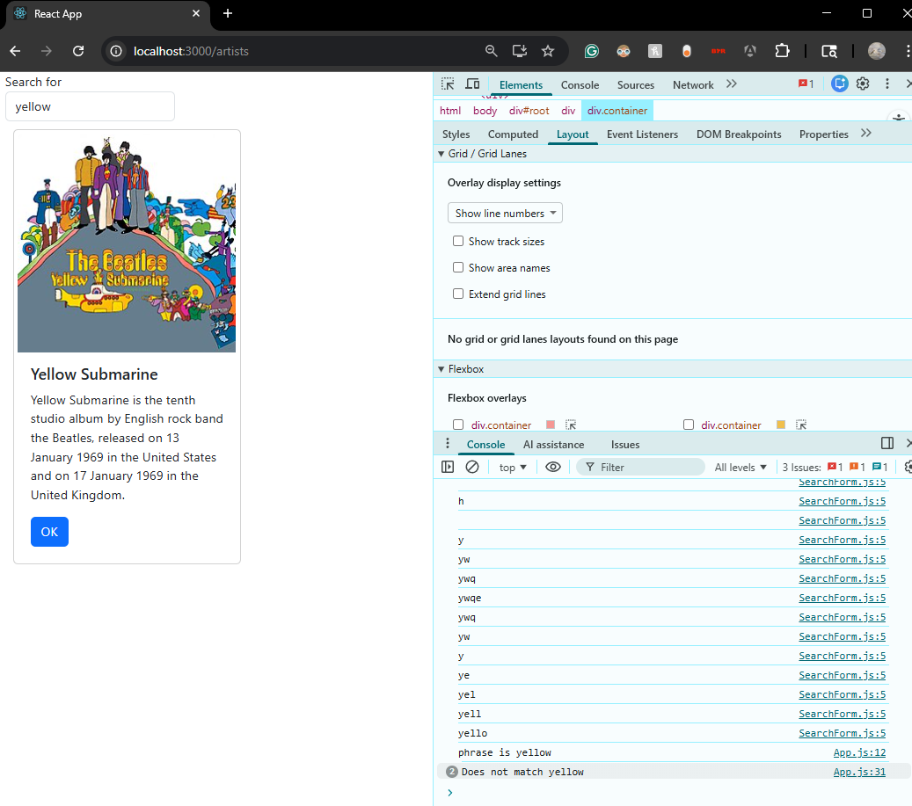
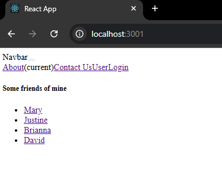
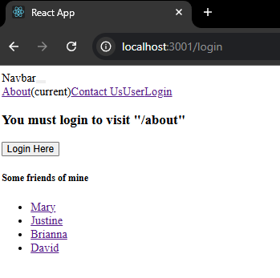
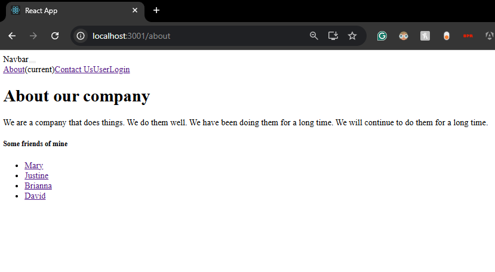
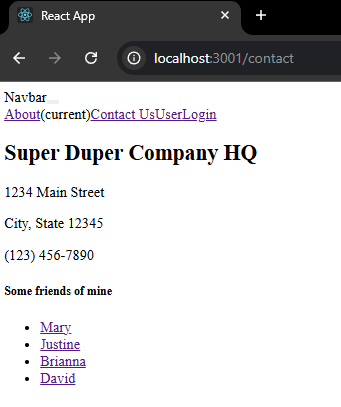
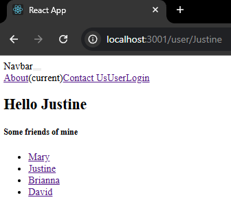
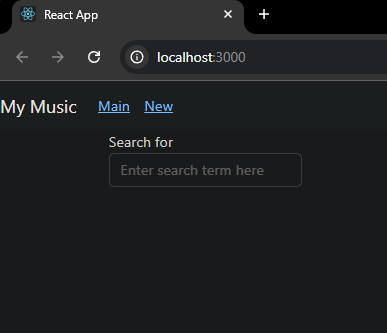
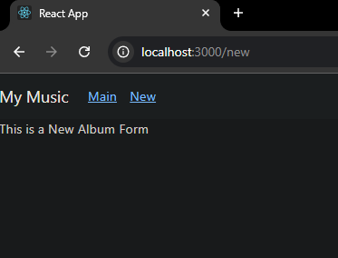

# Activity 6

- Author: Ty Gilbert
- 17 April 2026

## Summary

Activity 6 continued the React work from the previous activity by building on the earlier hard-coded music app and then introducing external data sources and client-side routing. In this activity, I first returned to the music app and moved the album data out of hard-coded state into a local JSON file. Later, the app was connected to an external REST-style data source. I then created a second React app from scratch to practice routing concepts such as protected routes, redirects, and route parameters. Finally, I returned to the music app and expanded it into a multi-page application with navigation between the main page, a new album page, and a single album details page.

## Part 1: External Data Sources in the Music App

### Returning to the music app

At this point in the activity, I returned to the music application and continued building on the earlier hard-coded version of the app. This section did not begin with an external REST source right away. Instead, the album data was first moved out of the React state initialization and into a local JSON file, and only later was the app connected to an external REST-style service.

### Adding an external data source

- First moved the album list out of hard-coded state and into a local `albums.json` file
- Added a `SearchForm` component so the user can type a search phrase
- Added component state for both the album list and the current search phrase
- Used `useEffect` so that album data loads when the component is first rendered
- Later added Axios through a reusable `dataSource.js` file to make HTTP requests
- Later connected the app to an external REST-style service
- Filtered the loaded albums locally based on the search phrase entered by the user

By this stage of the section, the app had moved beyond the original hard-coded data. The progression in the guide was from hard-coded state, to a local JSON file, and then to an external REST-style source. You can see in the screenshot below that the app is able to read the user input, narrow the list of albums, and print debugging information into the browser console while the search term is being typed.

### Summary

In this part of the activity, I continued improving the music app by starting from the earlier hard-coded version, then moving the album data into a local JSON file, and later loading information from an external source. The main ideas introduced here were `JSON file`, which stores structured data outside the component, `Axios`, which is used to make HTTP requests, `REST service`, which returns data to the frontend, `useEffect`, which runs code after rendering, and `state`, which allows the app to remember values such as the current search phrase and album list.

## Part 2: Mini App #2 - Routing Application Demo

### Creating the routing demo from scratch

For this segment of the activity, I created a brand new React application from scratch in order to practice routing before adding the same ideas back into the music app.

### Building the router app

- Created a new React application named `router`
- Added `react-router-dom` to support client-side navigation
- Added a `NavBar` component for moving between routes
- Added routes for the main page, about page, contact page, login page, and user page
- Added a `PrivateRoute` component so some routes require login first
- Added redirect behavior that sends the user to the login page when necessary
- Used a route parameter so the user page can display different names from the URL

The images below show the various features that were demonstrated in this lesson.

This first screenshot shows the base router page with the navigation bar and the list of example user links.

This second screenshot shows what happens when I attempt to visit a protected route before logging in.

After logging in, I was able to visit the About page successfully.

The Contact page also works through the routing system once access is granted.

This final screenshot from the router demo shows a dynamic route using a URL parameter to display a specific username.

### Summary

In this section, I created a React routing application from scratch and learned how client-side navigation works in a single-page application. The main new feature added was routing, which allows different components to be displayed based on the URL without reloading the page. New terminology introduced in this lesson includes `BrowserRouter`, `Routes`, `Route`, `Link`, `useNavigate`, `useLocation`, and `useParams`. I also demonstrated protected routing with a `PrivateRoute` component, which restricts access to certain pages unless the user is logged in.

## Part 3: Final Segment - Adding Routing to the Music App

### Returning to the music app one last time

In the final segment of the activity, I returned to the music app and expanded it from a searchable list into a larger application with multiple views. This part combined the earlier work from the external data section with the routing ideas from the router demo.

### Extending the music app with routes

- Added `react-router-dom` to the music app
- Wrapped the application in `BrowserRouter`
- Added a `NavBar` component with navigation links
- Added a main route for the searchable album list
- Added a `/new` route for a new album page
- Added a `/show/:albumId` route for a single album details page
- Used `useNavigate` to move to the album details page when an album is selected
- Used `useParams` to read the selected album id from the URL
- Connected the individual album page to the album list data so the proper album is displayed

The screenshot below shows the main music page after routing was added.

This final screenshot shows the route for creating a new album.

### Summary

In the final segment of the music application, I extended the project from a searchable list of albums into a multi-page React application by adding client-side routing with `react-router-dom`. This allowed the app to navigate between the main search page, a page for creating a new album, and a detail page for displaying one selected album. New terminology introduced in this section includes `routing`, `BrowserRouter`, `Routes`, `Route`, `Link`, `useNavigate`, and `useParams`. This final segment made the application feel more like a complete web app by separating features into their own pages while keeping navigation fast and dynamic.

## Conclusion

Overall, Activity 6 helped me better understand how React applications can grow from small, single-page interfaces into more complete applications that use external data and client-side routing. I was able to work with HTTP requests, mock REST services, protected routes, route parameters, and multi-page navigation. By the end of the activity, both the router demo and the music application felt more complete and more realistic.
