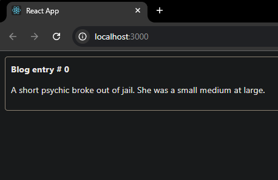
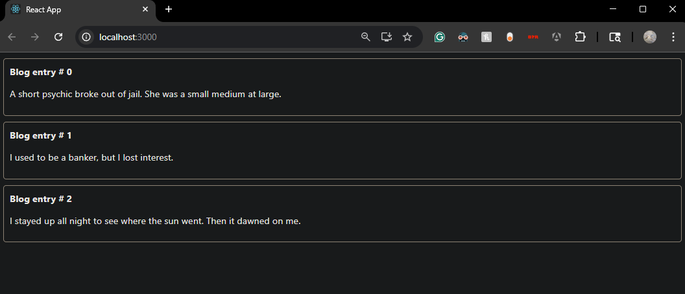
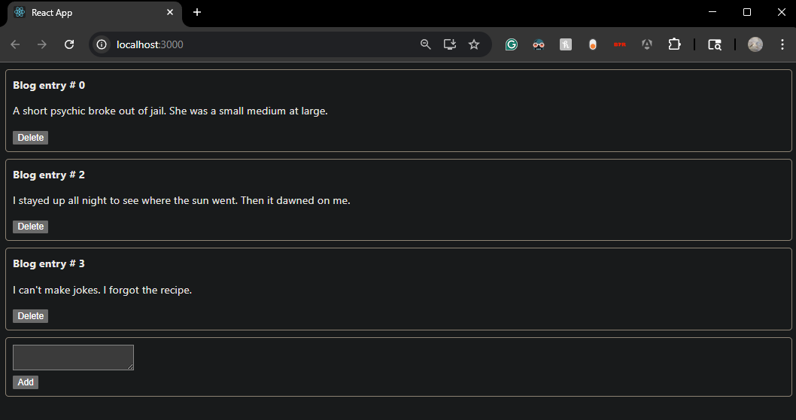
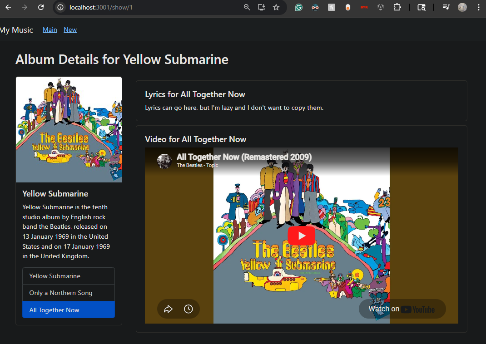
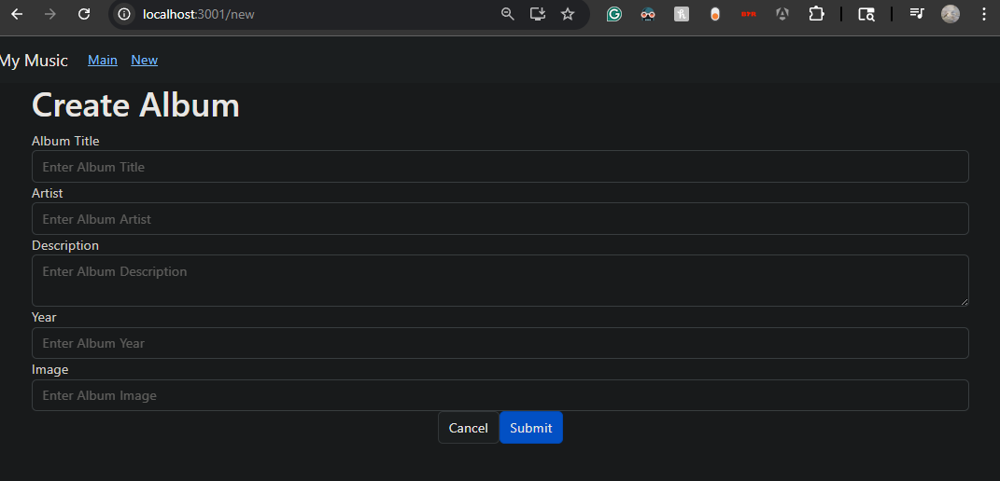
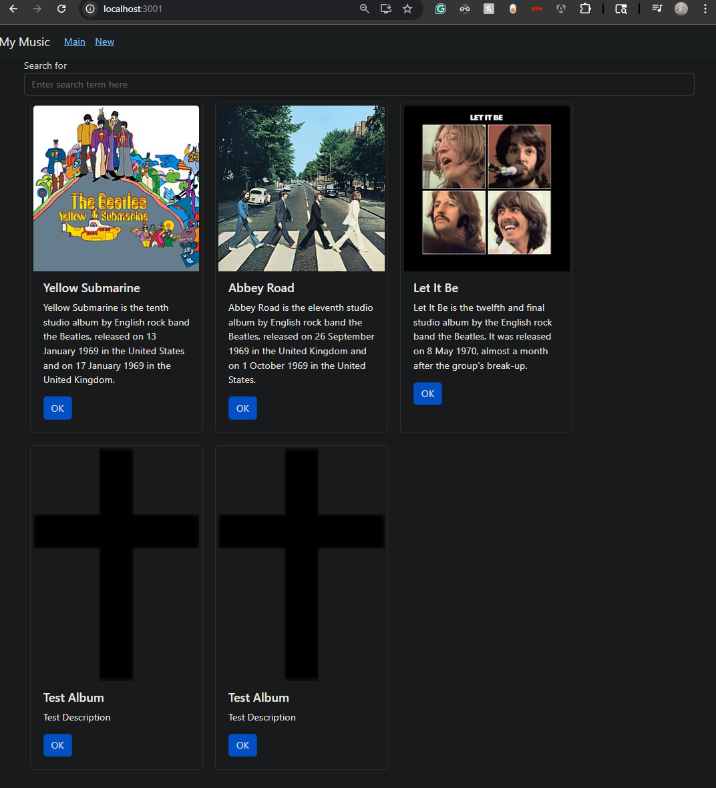
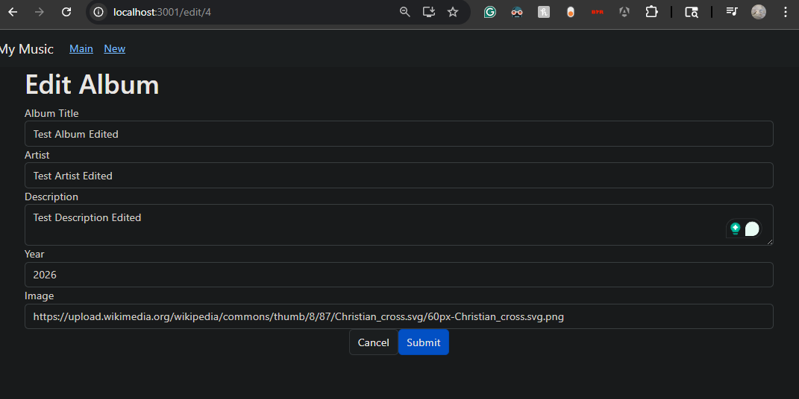
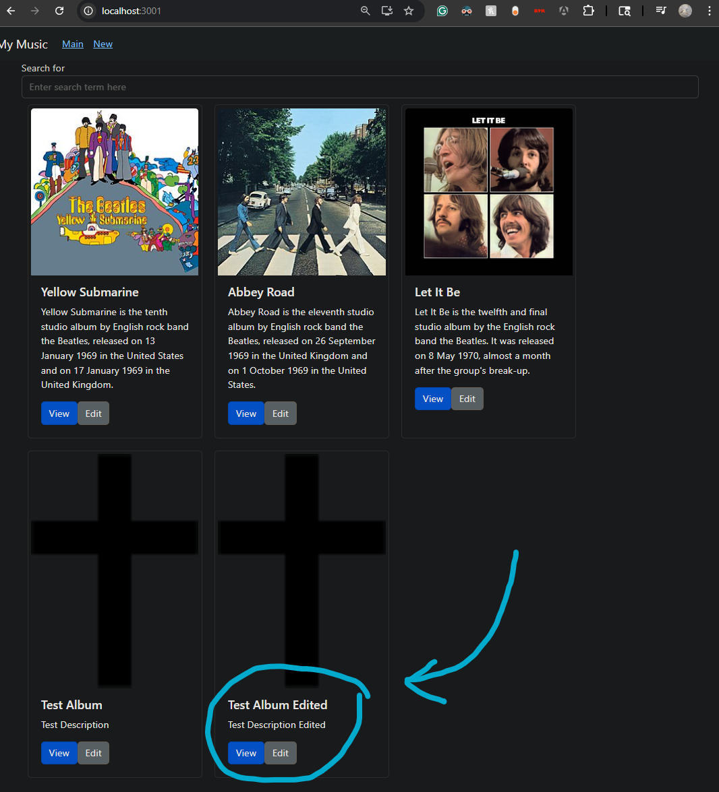

# Activity 7

- Author: Ty Gilbert
- 19 April 2026

## Summary

Activity 7 continued the React work from the previous activity by focusing on dynamic components and extending the music application with more complete user interactions. In this activity, I first created a small blog application to practice managing a dynamic list with React state, including adding and deleting posts. After that, I returned to the music app and completed the optional tracks, lyrics, and video section by turning the album details page into a more interactive screen. I then built a form for creating new albums and finished by adding the ability to edit existing albums. By the end of the activity, the music app supported viewing album details, adding albums, and editing albums through React components and REST-style requests.

## Part 1: Mini App #3 - Dynamic Components Demo

### Creating the blog application

For the first section of the activity, I built a small blog app to practice working with dynamic components in React. This mini app focused on rendering a list from state and then updating that list when the user interacted with the application.

### Building dynamic blog components

- Created a new React application for the blog demo
- Stored blog posts inside component state rather than hard-coding the rendered output
- Built a `Post` component to display each individual blog entry
- Used `map()` to dynamically generate the list of posts
- Added an `AddPost` component so a user can create a new blog entry
- Added delete functionality so a post can be removed from the list
- Passed callback methods from the parent component down into child components

The screenshots below show the dynamic components demo and the blog interactions that were added during this section.

### Summary

In this section, I learned how to build a dynamic list in React by storing data in `state` and then rendering components from that data. I also practiced passing callback methods through `props` so child components could notify the parent when a post should be added or deleted. New terminology used in this section included `dynamic components`, `state`, `props`, `callback`, and `map()`.

## Part 2: Tracks, Lyrics and Video

### Returning to the music app

After the blog demo, I returned to the music application and worked on the album details screen. This part of the activity was presented as an optional challenge, and I chose to complete it anyway.

### Extending the album detail page

- Expanded the `OneAlbum` page so it displays more than basic album information
- Added child components for a tracks list, individual track titles, lyrics, and video
- Added state so one selected track controls what lyrics and video are shown
- Updated the album data so each album contains track information
- Added direct YouTube links for the selected track video content
- Used click events so selecting a track updates multiple sections of the page

The screenshot below shows the optional album detail challenge that I completed for this section.

### Summary

In this section, I turned the `OneAlbum` screen into a more interactive detail page by breaking it into smaller child components and connecting them with shared state. This optional part gave me more practice with `component composition`, `state`, `props`, `event handling`, and `conditional rendering` because one selected track now updates multiple parts of the interface at the same time.

## Part 3: Create New Album

### Building the album form

In the next part of the activity, I created a form that accepts album information from the user and sends that data to the REST-style data source. This replaced the earlier placeholder page with a real React form.

### Adding a controlled form

- Replaced the placeholder `NewAlbum` component with a Bootstrap-based form
- Added separate `useState` values for the album title, artist, description, year, and image
- Added `onChange` handlers so each form field behaves as a controlled component
- Added a submit handler that builds a new album object from the form values
- Sent the new album to the REST-style data source with `axios`
- Added a cancel button to return to the main page

The screenshots below show the create-new-album portion of the activity.

### Summary

In this section, I built a controlled data entry form for creating albums. I used React `state` to store the current form values, `onChange` methods to keep the state updated, and a submit handler to package the form data into an album object before sending it to the server. New terminology used in this section included `controlled components`, `form submission`, `event handling`, `axios`, and `useNavigate`. I chose not to complete the optional portion for this section, which included adding tracks in the form, showing feedback messages, and automatically returning to the main page while refreshing the album list.

## Part 4: Edit an Album

### Adding album editing support

In the final part of the activity, I added the ability to edit an existing album. The idea was to reuse the same general form structure from the new album page, but load it with data from the selected album when editing.

### Updating the music app for edit mode

- Added an `EditAlbum` component that behaves like the new album form but supports editing
- Allowed the form to switch between new-album mode and edit mode depending on whether an album is passed in `props`
- Preserved the selected album's existing id during updates
- Added logic to distinguish between `POST` for new data and `PUT` for updated data
- Added `View` and `Edit` buttons to the album cards
- Updated the selection logic so the application can route to either the show screen or the edit screen

The screenshots below show the edit-album portion of the activity.

### Summary

In this section, I expanded the music app so an existing album can be edited through a reusable form component. I practiced passing a selected album through `props`, switching between new and edit modes, and using different REST operations depending on whether I was creating or updating data. New terminology used in this section included `PUT`, `edit mode`, and reusable form logic. I chose not to complete the optional unfinished business for this section, which included editing music tracks in the form, showing success or failure feedback, automatically navigating back to the main page while refreshing the album list, and adding a cancel event for the edit form.

## Conclusion

Overall, Activity 7 helped me better understand how React applications can become more interactive through dynamic components, controlled forms, and editable data. I practiced building a mini application from state, extending an existing interface with optional advanced features, creating new records through a form, and editing records that already exist. By the end of the activity, the music application felt more complete because it supported viewing, creating, and editing albums in a way that was much closer to a real application.
