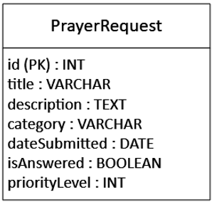
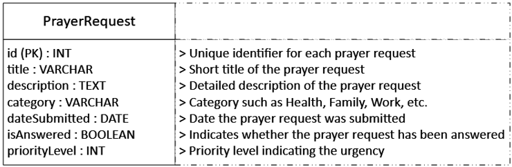
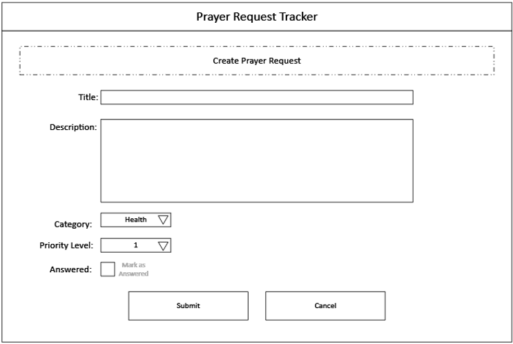
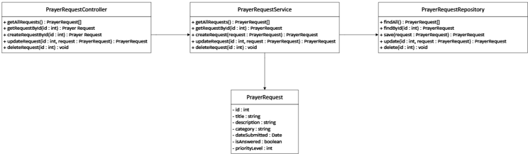

# Milestone 1

This is ***Milestone 1: Project Proposal***. Below is an overview of my proposed project program *Prayer Request Tracker*. This submission can be divided into multiple sections. Please review the table of contents for this submission:

1. Introduction / Overview
2. Functionality Requirements / User Stories
3. Initial Database Design / ER Diagram
4. Initial UI Sitemap
5. Initial UI Wireframes
6. Initial UML Classes
7. Risks

---

## 1: Introduction / Overview

The proposal that I have for this project is to design and develop a web application called the *Prayer Request Tracker*. This application will allow users to create, view, update, and delete prayer requests in a centralized system. The application will support users who want to keep track of prayer needs within a church, ministry group, personal devotional practice, or other context.

The system will store prayer requests inside of a MySQL database and then expose the data through a RESTful API that is built using Node.js and Express. Two separate front-end web applications will interact with the same backend API. The first implementation will use the Angular JS framework, and then the second implementation will use the React JS framework.

The application will demonstrate full stack architecture consisting of a database layer, a backend REST API, and two independent frontend clients. As already mentioned, the system will support basic CRUD operations for managing the prayer requests.

## 2: Functionality Requirements / User Stories

1. **View Prayer Requests**
   1. As a user, I want to be able to view a list of all prayer requests so that I can see what needs prayer.
2. **Create Prayer Request**
   1. As a user, I want to add a new prayer request so that I can record something that needs prayer.
3. **View Prayer Request Details**
   1. As a user, I want to be able to open a prayer request so that I can read the full description of the prayer so that I know what to pray for.
4. **Update Prayer Request**
   1. As a user, I want to be able to edit an existing prayer request so that I can update its information.
5. **Delete Prayer Request**
   1. As a user, I want to be able to delete a prayer request so that I can remove requests that are no longer needed.
6. **Mark Prayer Request as Answered**
   1. As a user, I want to be able to mark a prayer request as answered so that I can track when prayers have been fulfilled.

## 3: Initial Database Design / ER Diagram:

The database design is basic, and at its current state has only one table:

## 4: Initial UI Sitemap

This application only manages one product type, so the sitemap diagram only has one diagram:

## 5: Initial UI Wireframes

These wireframes will provide a reference for what is required of the UI, and introductory look at the overall design of the final application. I designed 4 wireframe diagrams, each will get there own section:

### Wireframe 1: Home Page

This is a look at the home page, on the Home Page you can see that we are able to add new prayer requests, view general details about prayer requests, search and filter through existing prayer requests, and interact with each prayer request that is displayed. This view is assuming that you own all the prayer requests, users will only be able to interact (edit or delete) prayer requests that they own, otherwise, they will only have access to the 'Details' link.

### Wireframe 2: Create Prayer Requests Page

On this page, users will be able to create a new prayer request. They can include a title, description, category (i.e. Health), priority level, and flag whether the prayer has been answered or not.

### Wireframe 3: Prayer Request Details Page

On this page, users can view details of a prayer request. In prayer requests where the description is two long to view on the home page, this page will provide them full access to the entirety of the description.

### Wireframe 4: Edit Prayer Request Page

On this page, users are able to edit prayer requests that they own. This allows them to update the details of the prayer request such as title, description, category (i.e. Health), priority level, and flag whether the prayer has been answered or not.

## 6: Initial UML Classes

This UML class diagram shows the structure of my proposed backend design:

## 7: Risks

I can think of several risks going into this project...

1. **Learning Curve of Frameworks**
   1. Both Angular and React will be used to implement the front-end application. Differences between these frameworks might require me to spend some additional time to understand it correctly and implement accordingly.
2. **API Consistency**
   1. The backend REST API needs to be designed in a way that supports both Angular and React front-end applications without requiring changes to the API design.
3. **Time Management**
   1. Building two separate front-end applications connected to the same backend service is going to require me to be careful with my time management between the Milestone deliverable dates.

---

Thank you for taking the time to look through my proposal. 

***Additional Note:** All diagrams featured in this proposal were created inside of Visio, and since I spent multiple hours making them, I decided not to recreate them inside of MD. Please forgive the inconvience.*