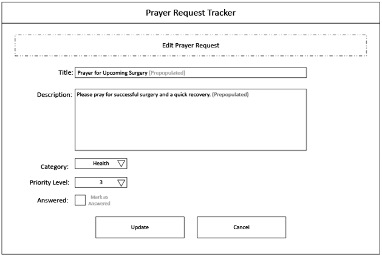
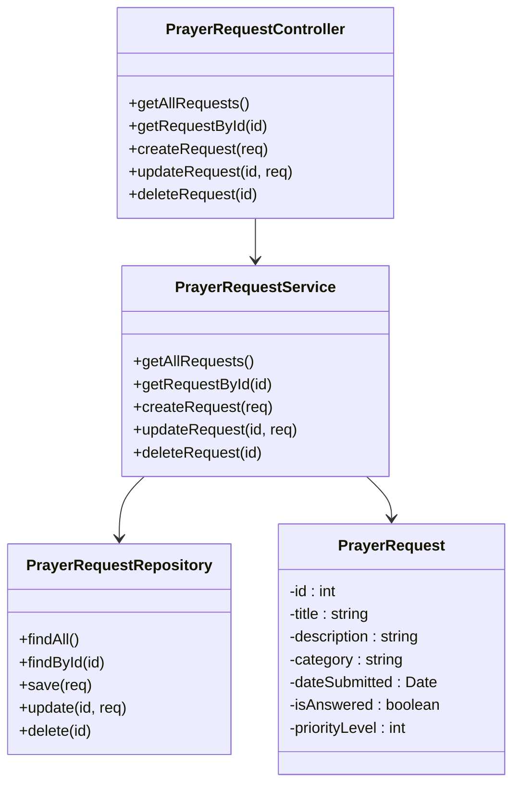

# Milestone 3

- Author:  Ty Gilbert
- Date:  19 March 2026

This is ***Milestone 3***. Below is an overview of my project program *Prayer Request Tracker*. This submission can be divided into multiple sections. Please review the table of contents for this submission:

1. Introduction / Overview
2. Functionality Requirements / User Stories
3. Initial Database Design / ER Diagram
4. Initial UI Sitemap
5. Initial UI Wireframes
6. Initial UML Classes
7. REST Endpoints
8. API Example API Requests
9. Screencast Recording
10. Conclusion

---

## 1: Introduction / Overview

This project is called the *Prayer Request Tracker*. This application allows users to create, view, update, and delete prayer requests in a centralized system. The application can support users who want to keep track of prayer needs within a church, ministry group, personal devotional practice, or other context.

The system stores prayer requests inside of a MySQL database and then exposes the data through a RESTful API that is built using Node.js and Express. Two separate front-end web applications will interact with the same backend API. The first implementation will use the Angular JS framework, and then the second implementation will use the React JS framework.

This application demonstrates full stack architecture consisting of a database layer, a backend REST API, and two independent frontend clients. As already mentioned, the system supports basic CRUD operations for managing the prayer requests. As of Milestone 3, only the backend REST API has been completed and will be demonstrated.


## 2: Functionality Requirements / User Stories

1. **View Prayer Requests**
   1. As a user, I want to be able to view a list of all prayer requests so that I can see what needs prayer.
2. **Create Prayer Request**
   1. As a user, I want to add a new prayer request so that I can record something that needs prayer.
3. **View Prayer Request Details**
   1. As a user, I want to be able to open a prayer request so that I can read the full description of the prayer so that I know what to pray for.
4. **Update Prayer Request**
   1. As a user, I want to be able to edit an existing prayer request so that I can update its information.
5. **Delete Prayer Request**
   1. As a user, I want to be able to delete a prayer request so that I can remove requests that are no longer needed.
6. **Mark Prayer Request as Answered**
   1. As a user, I want to be able to mark a prayer request as answered so that I can track when prayers have been fulfilled.

## 3: Initial Database Design / ER Diagram:

The database design is basic, and at its current state has only one table:

### PrayerRequest

|Field|Type|Notes|
|-|-|-|
|id|INT|PK|
|title|VARCHAR||
|description|TEXT||
|category|VARCHAR||
|dateSubmitted|DATE||
|isAnswered|BOOLEAN||
|priorityLevel|INT||

## 4: Initial UI Sitemap

This application only manages one product type, so the sitemap diagram only has one diagram:

### PrayerRequest

|Field|Type|Notes|Description|
|-|-|-|-|
|id|INT|PK|Unique identifier for each prayer request|
|title|VARCHAR||Short title of the prayer request|
|description|TEXT||Detailed description of the prayer request|
|category|VARCHAR||Category such as Health, Family, Work, etc.|
|dateSubmitted|DATE||Date the prayer request was submitted|
|isAnswered|BOOLEAN||Indicates whether the prayer request has been answered|
|priorityLevel|INT||Priority level indicating the urgency|

## 5: Initial UI Wireframes

These wireframes will provide a reference for what is required of the UI, and introductory look at the overall design of the final application. I designed 4 wireframe diagrams, each will get there own section:

### Wireframe 1: Home Page


This is a look at the home page, on the Home Page you can see that we are able to add new prayer requests, view general details about prayer requests, search and filter through existing prayer requests, and interact with each prayer request that is displayed. This view is assuming that you own all the prayer requests.

### Wireframe 2: Create Prayer Requests Page


On this page, users will be able to create a new prayer request. They can include a title, description, category (i.e. Health), priority level, and flag whether the prayer has been answered or not.

### Wireframe 3: Prayer Request Details Page


On this page, users can view details of a prayer request. This page will provide them full access to the details for a prayer request.

### Wireframe 4: Edit Prayer Request Page



On this page, users are able to edit prayer requests. This allows them to update the details of the prayer request such as title, description, category (i.e. Health), priority level, and flag whether the prayer has been answered or not.

## 6: Initial UML Classes

This UML class diagram shows the structure of my backend design:



## 7: REST Endpoints

The endpoints used in this application support full CRUD operations for managing prayer requests.

|Method|Endpoint|Description|
|-|-|-|
|GET|/requests|Retrieve all prayer requests|
|GET|/requests/:id|Retrieve a specific prayer request by ID|
|POST|/requests|Create a new prayer request|
|PUT|/requests/:id|Update an existing prayer request|
|DELETE|/requests/:id|Delete a prayer request|
|PATCH |/requests/:id/answer|Mark a prayer request as answered|

## 8: API Example API Requests

This segment covers example api requests and their json responses per the ones defined in 7: REST Endpoints

- GET /requests
```json
Response:
[
  {
    "id": 1,
    "title": "Prayer for Surgery",
    "description": "Please pray for a successful surgery and recovery.",
    "category": "Health",
    "dateSubmitted": "2026-03-09",
    "isAnswered": false,
    "priorityLevel": 3
  },
  {
    "id": 2,
    "title": "Job Guidance Prayer",
    "description": "Pray for direction in my career and job opportunities.",
    "category": "Work",
    "dateSubmitted": "2026-03-09",
    "isAnswered": true,
    "priorityLevel": 2
  }
]
```

- GET /requests/1

```json
Response:
{
  "id": 1,
  "title": "Prayer for Surgery",
  "description": "Please pray for a successful surgery and a quick recovery.",
  "category": "Health",
  "dateSubmitted": "2026-03-09",
  "isAnswered": false,
  "priorityLevel": 3
}
```

- POST /requests

```json
Request Body:
{
  "title": "Family Healing Prayer",
  "description": "Please pray for healing within my family.",
  "category": "Family",
  "priorityLevel": 2,
  "isAnswered": false
}

Response:
{
  "id": 3,
  "message": "Prayer request created successfully"
}
```

- PUT /requests/1

```json
Request Body:
{
  "title": "Prayer for Upcoming Surgery",
  "description": "Updated description...",
  "category": "Health",
  "priorityLevel": 4,
  "isAnswered": false
}

Response:
{
  "message": "Prayer request updated successfully"
}
```

- PATCH /requests/1/answer

```json
Response:
{
  "message": "Prayer request marked as answered"
}
```

DELETE /requests/1
```json
Response:
{
  "message": "Prayer request deleted successfully"
}
```

## 9: Screencast Recording

In this video I will demonstrate all the api endpoints for this application using postman, and also show the corresponding database changes using MySQL Workbench:

SCREENCAST GOES HERE.

## 11: Conclusion

Upon completeing Milestone 3, I learned how to structure a backend using layered architecture and how to build and test rest apis using express and postman. At it's current state, the application is a simple REST API backend, so I did not run into many issues building it. However, I did have issues with the MySQL connection. I was able to fix this issue by verifying my connection settings and adding error logging. Thus, I guess I can say that I learned a little bit about configurating a MySQL connection. Currently this application has no major bugs; input validation and authentication could benefit this application, but I do not think that is within the scope of this project. Looking forward to developing the UI.

---

***Additional Note:** Wireframe diagrams were made with Visio. The rest of the diagrams were made in native MD language and mermaid.*