# Milestone 4

- Author:  Ty Gilbert
- Date:  25 March 2026

This is ***Milestone 4***. Below is an overview of my project program *Prayer Request Tracker*. This submission can be divided into multiple sections. Please review the table of contents for this submission:

1. Introduction / Overview
2. Functionality Requirements / User Stories
3. Database Design / ER Diagram
4. UI Sitemap / Frontend Routes
5. UI Wireframes
6. Frontend Architecture / Angular Components
7. UML Classes
8. REST Endpoints
9. API Example API Requests
10. Screencast Recording
11. Changes Made Since Milestone 3
12. Conclusion

---

## 1: Introduction / Overview

This project is called the *Prayer Request Tracker*. This application allows users to create, view, update, and delete prayer requests in a centralized system. The application can support users who want to keep track of prayer needs within a church, ministry group, personal devotional practice, or other context.

The system stores prayer requests inside of a MySQL database and then exposes the data through a RESTful API that is built using Node.js and Express. Two separate front-end web applications will interact with the same backend API. The first implementation will use the Angular JS framework, and then the second implementation will use the React JS framework.

This application demonstrates full stack architecture consisting of a database layer, a backend REST API, and two independent frontend clients. As already mentioned, the system supports basic CRUD operations for managing the prayer requests. In Milestone 4, I built the Angular frontend client that connects directly to that existing backend API. The frontend does not replace the backend. Instead, it consumes the existing REST endpoints and presents the functionality in a browser-based user interface. This Milestone marks the concluding submission for the Angular portion of this project.

## 2: Functionality Requirements / User Stories

1. **View Prayer Requests**
   1. As a user, I want to be able to view a list of all prayer requests so that I can see what needs prayer.
2. **Create Prayer Request**
   1. As a user, I want to add a new prayer request so that I can record something that needs prayer.
3. **View Prayer Request Details**
   1. As a user, I want to be able to open a prayer request so that I can read the full description of the prayer so that I know what to pray for.
4. **Update Prayer Request**
   1. As a user, I want to be able to edit an existing prayer request so that I can update its information.
5. **Delete Prayer Request**
   1. As a user, I want to be able to delete a prayer request so that I can remove requests that are no longer needed.
6. **Mark Prayer Request as Answered**
   1. As a user, I want to be able to mark a prayer request as answered so that I can track when prayers have been fulfilled.

## 3: Database Design / ER Diagram

The database design remains focused on a single entity:

### PrayerRequest

|Field|Type|Notes|
|-|-|-|
|id|INT|PK|
|title|VARCHAR||
|description|TEXT||
|category|VARCHAR||
|dateSubmitted|DATE||
|isAnswered|BOOLEAN||
|priorityLevel|INT||

The Angular frontend uses this same structure when interacting with the backend API.

This application manages one main product type, Prayer Request, and the Angular frontend exposes four user-facing views.

### Frontend Routes

| Route | View | Purpose |
| - | - | - |
| /requests | Home / List | Display all prayer requests with search, filter, and actions |
| /requests/new | Create | Add a new prayer request |
| /requests/:id | Details | View full prayer request details |
| /requests/:id/edit | Edit | Update an existing prayer request |

### PrayerRequest Fields Used in the Frontend

| Field | Type | Notes | Description |
| - | - | - | - |
| id | INT | PK | Unique identifier for each prayer request |
| title | VARCHAR | | Short title of the prayer request |
| description | TEXT | | Detailed description of the prayer request |
| category | VARCHAR | | Category such as Health, Family, Work, etc. |
| dateSubmitted | DATE | | Date the prayer request was submitted |
| isAnswered | BOOLEAN | | Indicates whether the prayer request has been answered |
| priorityLevel | INT | | Priority level indicating urgency |

## 5: Initial UI Wireframes

The Angular frontend implementation was built to follow the original wireframes as closely as practical.

### Wireframe 1: Home Page


This view was implemented as the list page. It includes:

- a header for the Prayer Request Tracker title
- an add new request button
- a search input
- a filter dropdown
- a table listing the prayer requests
- action links for details, edit, and delete

Here is a screenshot of what the final page looks like as of now:

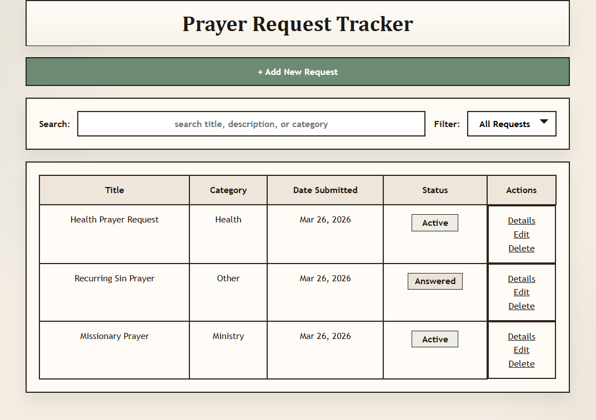

### Wireframe 2: Create Prayer Requests Page


Users can enter a title, description, category, priority level, and answered status.

Here is a screenshot of what the final page looks like as of now:

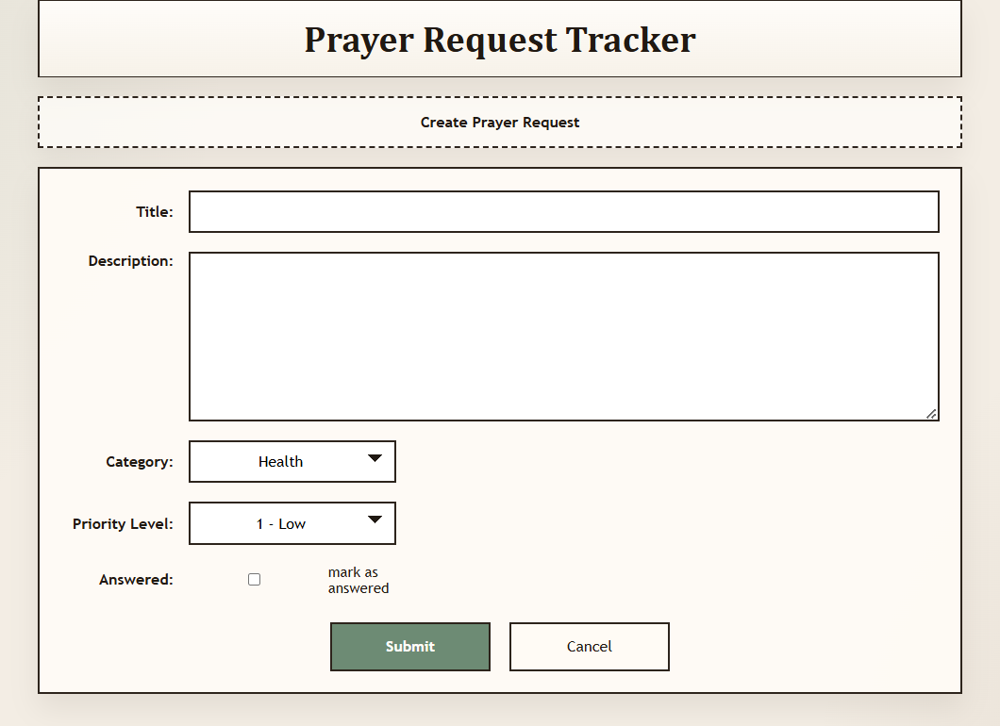

### Wireframe 3: Prayer Request Details Page


This page displays the selected prayer request in a readable details layout including title, category, date submitted, priority label, status label, and full description.

Here is a screenshot of what the final page looks like as of now:

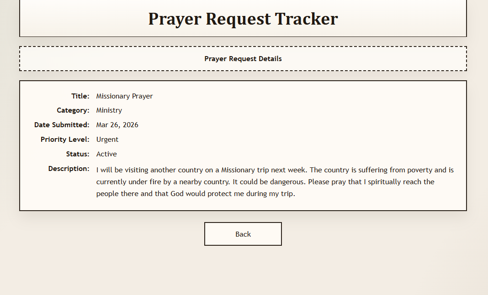

### Wireframe 4: Edit Prayer Request Page


This page uses the same shared form as the create page, but it is prepopulated with the selected prayer request data so the user can edit the prayer.

Here is a screenshot of what the final page looks like as of now:

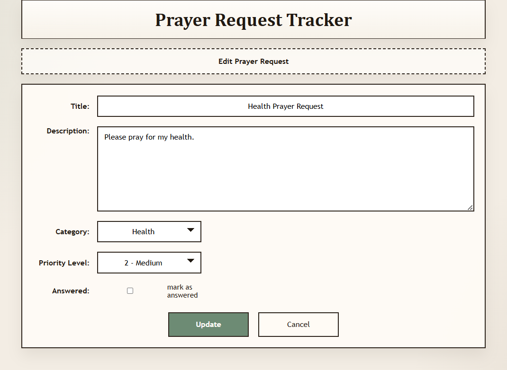

## 6: Frontend Architecture / Angular Components

Everything is written using Angular 21.

### Main Angular Structure

| Type | Name | Purpose |
| - | - | - |
| Root Component | App | Provides the application shell and router outlet |
| Service | PrayerRequestService | Handles HTTP calls to the backend API |
| Shared Component | PrayerRequestFormComponent | Shared reactive form for create and edit |
| Page Component | RequestListComponent | Home/list page |
| Page Component | RequestCreateComponent | Create page |
| Page Component | RequestDetailsComponent | Details page |
| Page Component | RequestEditComponent | Edit page |

### Angular Frontend Flow

1. The Angular application starts and routes the user to `/requests`.
2. The `RequestListComponent` then loads all the prayer requests from the backend.
3. When the user selects create, details, or edit, Angular routing navigates them back to the appropriate page.
4. The `PrayerRequestService` then communicates with the backend using `HttpClient`.
5. The shared `PrayerRequestFormComponent` is reused by both the create and edit pages to remove any duplication.

## 7: UML Classes

This UML class diagram shows the structure of my backend design:

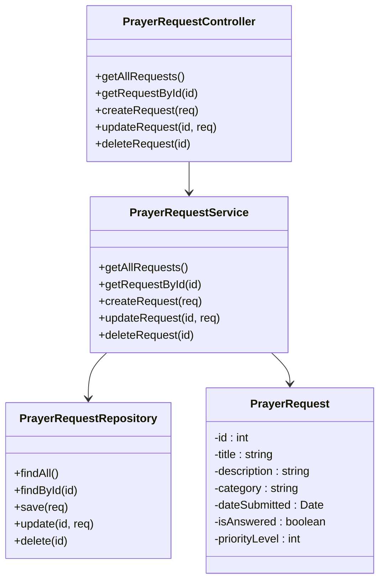

## 8: REST Endpoints

The frontend connects to the existing backend at:

`http://localhost:3000/api`

The Angular frontend uses the following endpoints:

| Method | Endpoint | Description |
| - | - | - |
| GET | /api/requests | Retrieve all prayer requests |
| GET | /api/requests/:id | Retrieve a specific prayer request by ID |
| POST | /api/requests | Create a new prayer request |
| PUT | /api/requests/:id | Update an existing prayer request |
| DELETE | /api/requests/:id | Delete a prayer request |
| PATCH | /api/requests/:id/answer | Mark a prayer request as answered |

These endpoints were already available from Milestone 3 and were preserved during the Milestone 4 implementation.

## 9: API Example API Requests

This segment covers example api requests and their json responses per the ones defined in 8: REST Endpoints

- **GET /requests**
```json
Response:
[
  {
    "id": 1,
    "title": "Prayer for Surgery",
    "description": "Please pray for a successful surgery and recovery.",
    "category": "Health",
    "dateSubmitted": "2026-03-09",
    "isAnswered": 0,
    "priorityLevel": 3
  },
  {
    "id": 2,
    "title": "Job Guidance Prayer",
    "description": "Pray for direction in my career and job opportunities.",
    "category": "Work",
    "dateSubmitted": "2026-03-09",
    "isAnswered": 1,
    "priorityLevel": 2
  }
]
```

Postman Screenshot:

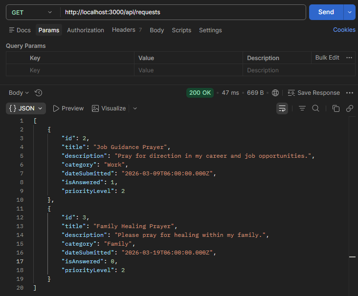

- **GET /requests/1**

```json
Response:
{
  "id": 1,
  "title": "Prayer for Surgery",
  "description": "Please pray for a successful surgery and a quick recovery.",
  "category": "Health",
  "dateSubmitted": "2026-03-09",
  "isAnswered": 0,
  "priorityLevel": 3
}
```

Postman Screenshot:

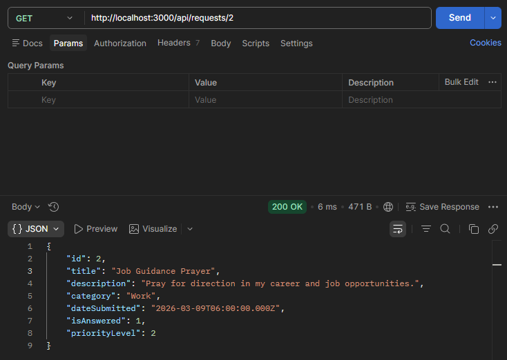

- **POST /requests**

```json
Request Body:
{
  "title": "Family Healing Prayer",
  "description": "Please pray for healing within my family.",
  "category": "Family",
  "priorityLevel": 2,
  "isAnswered": 0
}

Response:
{
  "id": 3,
  "message": "Prayer request created successfully"
}
```

Postman Screenshot:

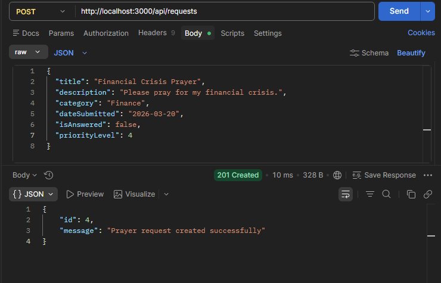

- **PUT /requests/1**

```json
Request Body:
{
  "title": "Prayer for Upcoming Surgery",
  "description": "Updated description...",
  "category": "Health",
  "priorityLevel": 4,
  "isAnswered": 0
}

Response:
{
  "message": "Prayer request updated successfully"
}
```

Postman Screenshot:

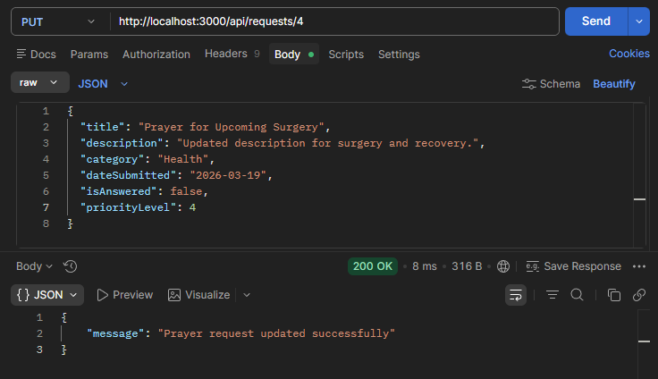

- **PATCH /requests/1/answer**

```json
Response:
{
  "message": "Prayer request marked as answered"
}
```

Postman Screenshot:

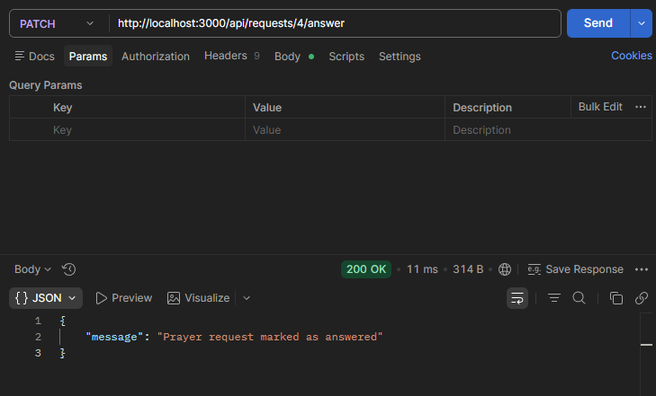

- **DELETE /requests/1**

```json
Response:
{
  "message": "Prayer request deleted successfully"
}
```
Postman Screenshot:

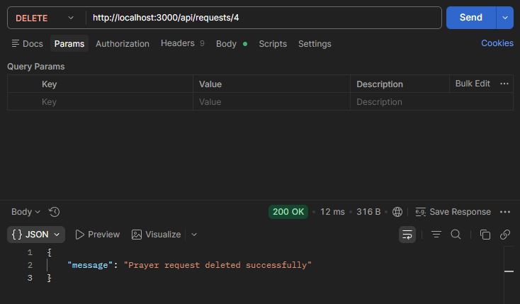

### MySQL Workbench Table Proof:

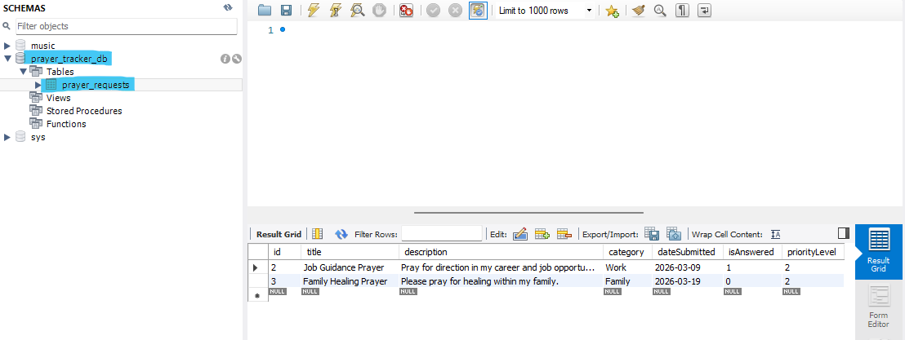


## 10: Screencast Recording

In this video I will demonstrate the full functionality of the application, with a primary focus on the newly integrated frontend application. I will then show corresponding database changes using MySQL Workbench.

Below are two ways to access the recording:

- Here is a link to the Loom screencast video: [Screencast Link](https://www.loom.com/share/f2cbf6d00d294e30adc1869f10a90abf)

- Below is a screenshot that you can click and it will redirect you to the video on Loom:

[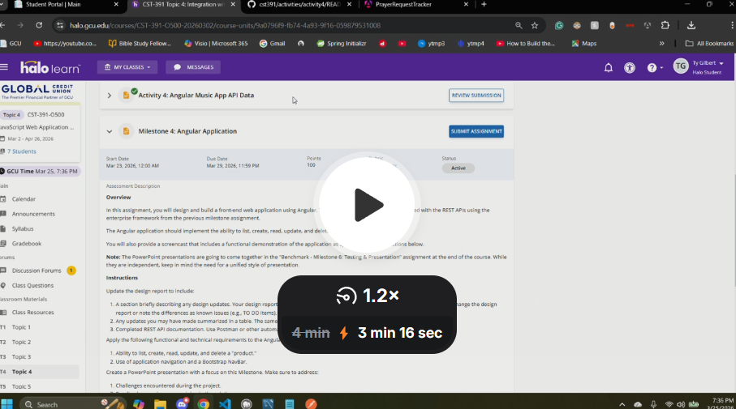](https://www.loom.com/share/f2cbf6d00d294e30adc1869f10a90abf)

## 11: Changes Made Since Milestone 3

The main changes introduced in Milestone 4 are:

1. Added an Angular 21 frontend application inside the existing project structure.
2. Connected the frontend directly to the existing backend at `http://localhost:3000/api`.
3. Implemented four main frontend views:
   - list/home
   - create
   - details
   - edit
4. Added a shared reactive form component for create and edit.
5. Added local search and filter support on the list page.
6. Preserved the backend folder and backend functionalit; all functional changes were made strictly to the frontend.

Unlike Milestone 3, this milestone is no longer backend only. The project now has a working user interface that consumes the prayer request REST API. This accomplishment marks the completion of the Angular development for this project.

## 12: Conclusion

Upon completing Milestone 4, I learned how to connect an Angular frontend to an existing REST API and how to organize an Angular application using standalone components, routing, services, and reactive forms. This milestone helped me better understand how the frontend and backend layers work together in a full stack application.

One of my biggest goals for this milestone was trying to keep the implementation as minimially disruptive as possible by preserving the backend and then building the UI directly on top of the API that already existed.

At this point, the Prayer Request Tracker is now a fully functional full stack application with a working Angular frontend.

---

***Additional Note:** Wireframe diagrams were made with Visio. The rest of the diagrams were made in native MD language and mermaid. The finalized Angular frontend implementation was designed to follow those wireframes as closely as possible while keeping the code as easy to maintain as possible.*
